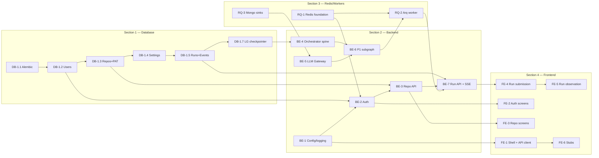

# Implementation Plan — Epic → Story → Task

> Developer-ready, sequenced plan. Sections run in the order **Database → Backend → Caching/Workers → Frontend**. Within and across sections, stories are ordered so that every prerequisite lands before its consumer. Each task carries an Expectation and a binary Success Criteria.

Reference architecture: [ARCHITECTURE.md](ARCHITECTURE.md). Phase 1 node plan: [PHASE-1-BLUEPRINT.md](PHASE-1-BLUEPRINT.md). Decisions: [adr/](adr/).

---

## Section 1: Database (PostgreSQL)

### Epic DB-1: Relational schema and migration foundation (enables auth, repos, runs)

#### Story DB-1.1: Provision Postgres 16 with pgvector, under Alembic control — *enables every downstream API story*

* **Task:** Use the `pgvector/pgvector:pg16` image in `docker-compose.yml` service `postgres`; create DB `zerodebt`, user `zerodebt`; add Alembic to `pyproject.toml`; scaffold `src/zero_debt/db/migrations/` with `alembic.ini` pointing at `POSTGRES_URL`.
* **Expectation:** Alembic auto-detects models via `src/zero_debt/db/models.py`; migration env uses `sqlalchemy.ext.asyncio`. Extensions `pgvector` and `pg_trgm` enabled via an initial migration `0001_extensions`. Connection pool bounded (max 20).
* **Success Criteria:** `alembic upgrade head` on a fresh container completes with exit 0; `\dx` in psql shows `vector` and `pg_trgm`; `SELECT 1` through the app's async session returns.

#### Story DB-1.2: Users table — *prerequisite for auth and every authorized route*

* **Task:** Add SQLAlchemy model `User(id: UUID PK, email: citext UNIQUE, password_hash: text, display_name: text, role: enum('user','admin'), disabled: bool default false, created_at: timestamptz, last_login_at: timestamptz nullable)` with Alembic migration `0002_users`.
* **Expectation:** `email` uses the `citext` extension (added in 0001) for case-insensitive uniqueness. `password_hash` is never selected into log output (column-level attribute documented). Seed migration inserts one admin user only when env `ZD_SEED_ADMIN=1` — never in prod.
* **Success Criteria:** `pytest tests/unit/db/test_user_model.py` passes assertions for unique-email, citext case-insensitivity, and default role; `alembic upgrade head && alembic downgrade -1` round-trips cleanly.

#### Story DB-1.3: Repo connections table with encrypted PAT — *prerequisite for any repo-scoped API*

* **Task:** Model `RepoConnection(id: UUID PK, user_id: FK users.id CASCADE, github_url: text NOT NULL, default_branch: text, pat_ciphertext: bytea, pat_nonce: bytea, short_name: text nullable, created_at: timestamptz, last_validated_at: timestamptz nullable, UNIQUE(user_id, github_url))`.
* **Expectation:** PAT stored encrypted via AES-GCM using `PAT_ENCRYPTION_KEY`; plaintext PAT **never** appears as a column. Decryption lives in `tools/github_tool.py` executed inside workers, not API. Index on `user_id`.
* **Success Criteria:** A round-trip test encrypts + persists + reads back + decrypts successfully with the key; a raw SQL dump of the table shows no recognizable PAT bytes; trying to connect the same URL twice per user raises `UniqueViolation`.

#### Story DB-1.4: Repo settings (per-phase overrides) table — *prerequisite for run enqueue config resolution*

* **Task:** Model `RepoSetting(id: UUID PK, repo_connection_id: FK repos CASCADE, phase: text CHECK IN ('sonar_fix','unit_test_gen','code_review','pr_fix','e2e_test_gen'), config_override: jsonb NOT NULL, UNIQUE(repo_connection_id, phase))`.
* **Expectation:** `config_override` validated at the application layer by per-phase Pydantic models before insert/update. JSONB GIN index deferred until load warrants it.
* **Success Criteria:** Inserting two rows with the same `(repo_connection_id, phase)` raises `UniqueViolation`; schema accepts arbitrary nested JSON objects.

#### Story DB-1.5: Runs table + artifacts + events (hot) — *the run lifecycle backbone*

* **Task:** Models `Run(id: UUID PK, user_id FK, repo_connection_id FK, phase text, status enum('pending','running','succeeded','failed','partial','cancelled'), input_payload jsonb, output_payload jsonb, work_branch text nullable, pr_number int nullable, pr_url text nullable, created_at timestamptz, started_at nullable, finished_at nullable, worker_id text nullable)`; `RunArtifact(id UUID PK, run_id FK CASCADE, kind text, uri text, created_at)`; `RunEvent(id UUID PK, run_id FK CASCADE, kind text, payload jsonb, at timestamptz)`.
* **Expectation:** `RunEvent` in Postgres keeps only the last **200 events per run** for UI backfill; full history goes to Mongo. A DB trigger or application-side trim enforces this. Indexes on `(user_id, created_at DESC)` and `(repo_connection_id, created_at DESC)` for history pagination.
* **Success Criteria:** Inserting 250 events for a run leaves exactly 200 rows; history query for a user with 10k runs returns first page in <50ms on seeded data.

#### Story DB-1.6: Sessions table fallback — *optional durable session backup*

* **Task:** Model `Session(token_hash text PK, user_id FK, created_at, expires_at, revoked_at nullable)` with an index on `user_id`.
* **Expectation:** Redis is the primary session store; Postgres mirror is written only when `auth.persist_sessions=true` (default `false`). Used for forced-logout-on-password-change auditability.
* **Success Criteria:** With the flag off, no row is ever written; with it on, revoking a session marks `revoked_at` within the same transaction as the password change.

#### Story DB-1.7: LangGraph checkpointer schema — *enables resumability*

* **Task:** Use LangGraph's Postgres checkpointer setup via `langgraph.checkpoint.postgres.AsyncPostgresSaver`; run its `setup()` inside an Alembic migration `0006_langgraph_checkpointer`.
* **Expectation:** Schema managed by LangGraph; our migration is thin and idempotent. A separate schema `langgraph` prevents collisions with app tables.
* **Success Criteria:** After migration, invoking a compiled graph with `checkpointer` configured writes to the `langgraph.checkpoints` table and can resume after a simulated worker kill.

#### Story DB-1.8: Vector store table (stub for post-P1) — *unused in P1 but provisioned early*

* **Task:** Migration creates `code_chunks(id UUID PK, repo_connection_id FK CASCADE, file_path text, chunk_id int, language text, embedding vector(1536), metadata jsonb, created_at)` with an `ivfflat` index on `embedding` (`lists=100`).
* **Expectation:** Table exists, is not written to during P1. The ANN index is acceptable even when empty.
* **Success Criteria:** Inserting a dummy row and running `SELECT ... ORDER BY embedding <-> $1 LIMIT 5` returns without error.

---

## Section 2: Backend (FastAPI + LangGraph)

### Epic BE-1: Configuration and bootstrap (enables every other backend story)

#### Story BE-1.1: Pydantic BaseSettings loading YAML + env

* **Task:** Implement `src/zero_debt/settings.py` with a `Settings` class loading `ZERO_DEBT_CONFIG` YAML and env var overrides; validate that no `*_TOKEN|*_KEY|*_SECRET|*_PASSWORD` keys appear in YAML at startup.
* **Expectation:** Single `get_settings()` accessor cached via `lru_cache`. Startup raises `SecretsInYamlError` with the offending key listed.
* **Success Criteria:** A test YAML with a password key in it causes app startup to exit with code 1; a clean YAML loads and exposes the full `config.phases.sonar_fix.max_issues_per_run` path.

#### Story BE-1.2: Structured logging (structlog JSON)

* **Task:** Configure structlog with JSON processor, redactor stripping keys matching the secrets regex, timestamp + `run_id` + `user_id` context binders.
* **Expectation:** All modules call `log = structlog.get_logger()`; no direct `logging.getLogger`. Contextvars carry `run_id` through async boundaries.
* **Success Criteria:** Unit test captures a log line that includes a field named `token=ghp_xxx` — assertion checks the emitted line contains `token: ***`.

### Epic BE-2: Authentication foundation (blocks every protected route)

#### Story BE-2.1: `AuthProvider` interface + `DbAuthProvider`

* **Task:** Define `src/zero_debt/auth/provider.py::AuthProvider` ABC with `login`, `verify_session`, `logout`. Implement `DbAuthProvider` using Argon2id via `argon2-cffi` and `itsdangerous.URLSafeTimedSerializer` for opaque session tokens.
* **Expectation:** Passwords verified via `PasswordHasher().verify` with constant-time comparison and auto-rehash on outdated params. Sessions stored in Redis `session:{token_hash}` → `UserPrincipal` JSON, TTL from `auth.session_ttl_minutes`.
* **Success Criteria:** `pytest tests/unit/auth/test_db_provider.py` passes: correct password returns `UserPrincipal`; wrong password raises `InvalidCredentials`; logout removes the Redis key.

#### Story BE-2.2: FastAPI dependencies `require_auth` and `require_admin`

* **Task:** `src/zero_debt/api/dependencies.py` provides FastAPI `Depends` callables that extract the session cookie, call `AuthProvider.verify_session`, return `UserPrincipal`, and 401 on failure.
* **Expectation:** Cookie name `zd_session`; `HttpOnly; Secure; SameSite=Lax`. Rejected with 401 and `WWW-Authenticate: Session` header. Admin dependency additionally checks `"admin" in principal.roles`.
* **Success Criteria:** An endpoint protected by `require_auth` returns 401 with no cookie, 401 with a forged cookie, 200 with a valid session; admin-only endpoint returns 403 for a plain user.

#### Story BE-2.3: Auth API routes

* **Task:** Router `src/zero_debt/api/routers/auth.py` exposing `POST /api/auth/login`, `POST /api/auth/logout`, `GET /api/auth/me`. Login sets cookie; logout clears it.
* **Expectation:** Login rate-limited per-IP (Redis counter, 5 failures per 15 min → 429). CSRF token issued as a second cookie on login, required on state-changing endpoints.
* **Success Criteria:** `pytest tests/integration/api/test_auth.py` covers happy-path login, wrong-password 401, rate-limit 429, logout clears cookie, `/me` returns the principal; all pass.

### Epic BE-3: Repository connection API (depends on BE-2)

#### Story BE-3.1: PAT encryption helper

* **Task:** `src/zero_debt/auth/secret_box.py` providing `encrypt(plaintext: str) -> tuple[bytes, bytes]` and `decrypt(ciphertext, nonce) -> str` using AES-GCM with `PAT_ENCRYPTION_KEY` (32 bytes from env, base64-decoded).
* **Expectation:** Fresh nonce per encryption; key length validated at startup. Decrypt only on worker side — import raises `DecryptionNotAllowedHere` in API process if `ZD_ROLE=api`.
* **Success Criteria:** Round-trip test encrypts then decrypts to the same plaintext; two encryptions of the same plaintext yield different ciphertexts; API-side `from zero_debt.auth.secret_box import decrypt` raises.

#### Story BE-3.2: Connect repo endpoint

* **Task:** `POST /api/repos` takes `{github_url, default_branch, short_name?, pat}`; validates PAT scope + repo access via GitHub `GET /repos/{owner}/{repo}`; encrypts PAT; inserts `RepoConnection`.
* **Expectation:** Return 400 on invalid URL, 401 on invalid PAT, 403 on insufficient scopes, 404 on repo not found, 409 on duplicate. Response includes inferred `default_branch` from GitHub even if user omitted it.
* **Success Criteria:** Integration test against a mocked GitHub (via `respx`) asserts each status code; a successful call inserts exactly one `RepoConnection` row with encrypted PAT; the raw PAT never appears in logs.

#### Story BE-3.3: List / get / update / delete repo endpoints

* **Task:** `GET /api/repos`, `GET /api/repos/{id}`, `PATCH /api/repos/{id}` (default_branch, short_name), `DELETE /api/repos/{id}`.
* **Expectation:** All filtered to `user_id = principal.user_id` (admin sees all). Delete cascades to runs and settings. GET returns language mix + last run summary joined via `Run` ordered by `created_at DESC LIMIT 1`.
* **Success Criteria:** User A cannot GET user B's repo (returns 404, not 403, to avoid enumeration); deleting a repo removes associated `RunEvent` rows in same transaction.

#### Story BE-3.4: Repo per-phase settings endpoints

* **Task:** `GET /api/repos/{id}/settings`, `PUT /api/repos/{id}/settings/{phase}`. PUT validates `config_override` against the phase's Pydantic override schema.
* **Expectation:** Unknown fields rejected; partial updates supported via PATCH-semantics. Write emits an `audit` event to Mongo.
* **Success Criteria:** PUT with an unknown key returns 422; valid PUT updates the row; `audit.action=repo_setting_updated` lands in Mongo.

### Epic BE-4: LangGraph orchestrator spine (depends on DB-1 complete; blocks Phase 1)

#### Story BE-4.1: `ZeroDebtState` TypedDict + enums

* **Task:** Implement `src/zero_debt/state.py` with `ZeroDebtState`, `AgentPhase`, `RunStatus`, `RepoRef` exactly as specified in ARCHITECTURE §2.2.
* **Expectation:** `total=False` TypedDict. All fields JSON-serializable. Smoke test round-trips through `json.dumps`/`json.loads`.
* **Success Criteria:** `pytest tests/unit/graph/test_state.py` asserts a sample `ZeroDebtState` instance serializes to JSON and back identically.

#### Story BE-4.2: Pre-nodes (`validate_inputs`, `clone_or_fetch_repo`, `build_repo_outline` stub)

* **Task:** Implement three async node functions in `src/zero_debt/graph/pre_nodes.py`.
* **Expectation:** `validate_inputs` resolves `config` by merging repo-level overrides over the global phase config. `clone_or_fetch_repo` shells out via `GitTool` to `repo_local_path = workspace_root/run_id/repo`. RIL stub returns a minimal `{files, languages}` dict.
* **Success Criteria:** Invoked with a seeded state + a test repo URL, produces a populated `repo_local_path` on disk and writes `repo_outline.files` to state.

#### Story BE-4.3: Phase router conditional edge + post-nodes + FAIL handler

* **Task:** `src/zero_debt/graph/routing.py` providing `phase_router(state)` returning the subgraph node name. Post-nodes: `post_phase_normalize`, `commit_and_push_branch`, `open_pull_request`, `generate_summary_report`, `emit_structured_log`, `fail_fast_handler`.
* **Expectation:** Router raises `UnknownPhaseError` if `active_phase` not in enum. Post-nodes are idempotent — re-running them on a terminal state is a no-op.
* **Success Criteria:** Running the orchestrator with `active_phase=sonar_fix` routes to the P1 subgraph; with an unsupported value returns 400 upstream before enqueue.

#### Story BE-4.4: Orchestrator assembly with Postgres checkpointer

* **Task:** `src/zero_debt/graph/orchestrator.py::build_graph()` returns a `CompiledStateGraph` with all nodes wired and `checkpointer=AsyncPostgresSaver(...)`.
* **Expectation:** Graph compiled once at worker startup; invocation uses `thread_id=run_id` for checkpoint isolation.
* **Success Criteria:** An integration test invokes the graph against a fixture repo, simulates a kill between `clone_or_fetch_repo` and `build_repo_outline`, restarts, and resumes to END without re-cloning.

### Epic BE-5: LLM Gateway (blocks P1 subgraph)

#### Story BE-5.1: Abstract gateway + Anthropic provider

* **Task:** `src/zero_debt/llm/gateway.py::LLMGateway` ABC; `providers/anthropic.py::AnthropicGateway` implementing `complete` and `stream`.
* **Expectation:** Logical model ids (`fast`, `code-smart`, `review-deep`) resolved via `model_registry.py` → concrete Claude model ids. Prompt caching enabled via `cache_control` on system + repository layers.
* **Success Criteria:** A golden-path unit test via `respx` replays a recorded Anthropic response and asserts `LLMResponse.structured` matches the requested JSON schema.

#### Story BE-5.2: JSON-schema enforcement + retry

* **Task:** Wrap `complete()` with a one-shot structured-retry: if `json_schema` is set and the response doesn't parse, retry once with a terse error-feedback system note.
* **Expectation:** Retry budget exactly 1; failures past that raise `LLMSchemaError` carrying the last response for diagnostics.
* **Success Criteria:** A test where the first mocked response is malformed JSON and the second is valid returns a successful `LLMResponse`; two consecutive malformed responses raise.

#### Story BE-5.3: MongoDB archive of every LLM call

* **Task:** `src/zero_debt/mongo/sinks.py::LLMArchiveSink` writes `{run_id, node, model, req_id, request, response, usage, latency_ms, cache_status}` to `zerodebt_telemetry.llm_interactions` after each call.
* **Expectation:** Write is best-effort — failure logs a warning, does not break the gateway call. Retention TTL (`telemetry.llm_archive_retention_days`) enforced via Mongo collection TTL index.
* **Success Criteria:** After a run, exactly one `llm_interactions` document exists per LLM call made; simulated Mongo outage logs a warning but the run still succeeds.

### Epic BE-6: Phase 1 subgraph (depends on BE-4, BE-5)

Details per node live in [PHASE-1-BLUEPRINT.md](PHASE-1-BLUEPRINT.md). This epic just sequences their delivery.

#### Story BE-6.1: Sonar report loader + Pydantic models

* **Task:** Implement `SonarReport`, `SonarIssue`, `FixProposal`, `ProposedPatch`, `AppliedFix`, `FixSummaryReport` Pydantic models. Node `load_sonar_report` parses a local JSON or calls `/api/issues/search`.
* **Expectation:** Schema mismatch raises `SonarReportSchemaError`; the node writes `warnings` entries for issues whose `component` is missing from the working tree.
* **Success Criteria:** A valid fixture report loads with the expected issue count; a corrupted field (e.g., unknown severity) produces a structured validation error with the field path.

#### Story BE-6.2: `group_issues_by_file` + `rank_issues` + `pick_next_file_batch`

* **Task:** Implement the three pure-logic nodes under `src/zero_debt/phases/sonar_fix/`. Deterministic ordering (`severity_weight × rule_fixability × file_churn_penalty`).
* **Expectation:** Same input ⇒ same ordering. Files absent from `repo_outline.files` excluded with a warning.
* **Success Criteria:** Calling `rank_issues` twice with identical input returns the same list order; unit test with 100 synthetic issues completes in <50ms.

#### Story BE-6.3: `fetch_file_context`

* **Task:** Load target file + neighboring symbols (up to `context_token_budget`) via `FSTool` and `repo_outline.module_graph`.
* **Expectation:** Token count estimated via tiktoken-compatible counter; context trimmed from the outside in if over budget.
* **Success Criteria:** Context for a 2k-line file fits under the budget; trimming logs a warning with count before/after.

#### Story BE-6.4: `propose_fix` (LLM call)

* **Task:** Invoke `LLMGateway.complete` with the three-layer prompt composition (system / repo / task) and `json_schema=FixProposal.model_json_schema()`.
* **Expectation:** Retry prompt delta appends error feedback only; stable layers stay cached. `confidence` in response used as a soft gate (rejection only if <0.6 AND validator failed).
* **Success Criteria:** A mocked LLM response producing a valid `FixProposal` with two patches passes through; one producing invalid JSON retries once and fails on the second attempt with `LLMSchemaError`.

#### Story BE-6.5: `validate_patch` (structural gates)

* **Task:** Five gates: `unidiff` parse + `patch --dry-run`, AST parse (tree-sitter), lint delta (language-native toolchain), optional compile (gated by config), line-overlap ±3.
* **Expectation:** Each gate contributes a structured reason code to a rejection event (`ast_fail`, `lint_regression`, `compile_fail`, etc.). Never calls an LLM.
* **Success Criteria:** Hand-crafted test patches pass or fail each gate as expected; a patch whose diff references a nonexistent line number is rejected with `overlap_miss`.

#### Story BE-6.6: `apply_patch` + rollback

* **Task:** Apply unified diff via `PatchTool`; on any exception, roll the affected files back to HEAD via `GitTool.checkout --`. Record applied patches to `phase_output.applied`.
* **Expectation:** Apply is atomic per file — partial application cleans up. `FSTool` enforces workspace jail.
* **Success Criteria:** Test with a deliberately malformed patch leaves the working tree at HEAD and marks the issue skipped; a valid patch leaves the tree with exactly the expected diff.

#### Story BE-6.7: `loop_controller` + `summarize_fixes`

* **Task:** Loop decides continue / abort based on `phase_iteration`, consecutive failure count, token budget. Summarizer builds `FixSummaryReport` and writes to `phase_output.summary`.
* **Expectation:** Graceful stop on budget exhaustion sets `status=PARTIAL`, never `FAILED`.
* **Success Criteria:** Synthetic run with 50 issues and a small token budget produces `status=PARTIAL` with `issues_fixed < 50` and all invariants intact; 50/50-fixing run produces `status=SUCCEEDED`.

### Epic BE-7: Run lifecycle API (depends on BE-2, BE-3, BE-4; workers wired in Section 3)

#### Story BE-7.1: `POST /api/runs` enqueue

* **Task:** Accept `{repo_connection_id, phase, input_payload}`; validate user owns the repo; check concurrency caps; insert `Run(status=pending)`; enqueue `arq_pool.enqueue_job("run_phase", run_id)`; return `{run_id, sse_url, status_url}`.
* **Expectation:** Concurrency cap check atomic with Redis `INCR`/`DECR` pair; on cap breach, no DB insert. Input payload validated against the phase's Pydantic input model before enqueue.
* **Success Criteria:** Happy-path returns 202; cap breach returns 429 without inserting a row; invalid input payload returns 422 and does not enqueue.

#### Story BE-7.2: `GET /api/runs` list (paginated, filterable)

* **Task:** Query params: `repo_connection_id?`, `phase?`, `status?`, `since?`, `limit<=100`, `cursor`. Returns runs scoped to the principal (admin sees all).
* **Expectation:** Uses keyset pagination on `created_at DESC, id DESC`. Joins repo short_name into the response.
* **Success Criteria:** 10k seeded runs, page 1 and page 50 each return in <100ms; cursor opaqueness tested.

#### Story BE-7.3: `GET /api/runs/{id}` detail

* **Task:** Return run row + last 200 events from Postgres + `artifacts` + summary section if `status` terminal.
* **Expectation:** 404 for runs not owned by the principal; admin sees all.
* **Success Criteria:** Detail for a completed run includes `output_payload.summary` populated; for a running run, events reflect what's been published so far.

#### Story BE-7.4: `POST /api/runs/{id}/cancel`

* **Task:** Set a Redis cancel flag `zerodebt:run:{id}:cancel=1`; workers poll this between nodes and abort cooperatively.
* **Expectation:** Flag TTL = run hard timeout. Idempotent — repeat calls return 200 without changing state past the first call.
* **Success Criteria:** After POST, a currently-running run reaches `status=cancelled` within one node boundary; already-terminal runs return 409.

#### Story BE-7.5: SSE endpoint `GET /api/sse/runs/{id}`

* **Task:** Uses `sse-starlette` `EventSourceResponse`. Subscribes to Redis stream `zerodebt:run:{id}:stream` via `XREAD` with `Last-Event-ID` support. Sends heartbeat every 15s.
* **Expectation:** Auth check on connection open; principal must own the run. Connection buffer bounded; slow clients disconnected with reason.
* **Success Criteria:** An `EventSource` client receives `node_start` → `node_end` → `terminal` events as a run progresses; disconnect + reconnect with `Last-Event-ID` resumes without missing events within the stream's retention.

---

## Section 3: Caching & Background Processing (Redis + Arq)

### Epic RQ-1: Redis foundation (blocks auth sessions and job queue)

#### Story RQ-1.1: Redis client + connection manager

* **Task:** `src/zero_debt/redis/client.py` with async connection pool (`redis.asyncio.Redis.from_url`). Separate `clients` for {sessions, queue, streams, counters}.
* **Expectation:** All commands await; pool size from config. Health probe on startup raises if unreachable.
* **Success Criteria:** Startup fails with `RedisUnreachable` if wrong URL; good URL passes health probe.

#### Story RQ-1.2: Session store

* **Task:** `src/zero_debt/redis/sessions.py` with `put(principal, token_hash, ttl)`, `get(token_hash) -> principal | None`, `delete(token_hash)`.
* **Expectation:** JSON-encoded; TTL via `SETEX`. Key pattern `session:{token_hash}`.
* **Success Criteria:** A put then get returns the identical principal; after TTL, get returns None.

#### Story RQ-1.3: Concurrency counters

* **Task:** `acquire_run_slot(user_id, repo_id) -> bool` that atomically `INCR` two keys (`concurrency:user:{id}`, `concurrency:repo:{id}`) and checks caps; `release_run_slot(...)` decrements both.
* **Expectation:** Implemented as a Lua script to keep it atomic. Counters have a TTL matching the run hard timeout as a safety net.
* **Success Criteria:** 3 concurrent acquire calls with cap=2 returns `true, true, false`; release restores the slot; simulated worker crash doesn't leak a counter past the TTL.

#### Story RQ-1.4: Pub/sub channel conventions + stream wrapper

* **Task:** `src/zero_debt/redis/pubsub.py::publish_event(run_id, kind, payload)` writes to Redis stream `zerodebt:run:{id}:stream` via `XADD`; a thin `subscribe(run_id, last_id="$")` async generator for SSE.
* **Expectation:** Streams (not pub/sub) used so reconnection with `Last-Event-ID` works. Stream trimmed to ~1000 entries per run via `MAXLEN ~`.
* **Success Criteria:** Publishing 10 events and subscribing returns all 10 in order; subscribing with `last_id=5th entry` returns the last 5.

### Epic RQ-2: Arq worker (depends on RQ-1, BE-4, BE-5, BE-6)

#### Story RQ-2.1: Worker entry + task registration

* **Task:** `src/zero_debt/worker/main.py` defines `WorkerSettings` with `queue_name=zerodebt:runs`, `functions=[run_phase]`, `on_startup`/`on_shutdown` wiring of DB + Redis + Mongo clients.
* **Expectation:** Graceful shutdown drains in-flight task once. Worker exposes a Prometheus `/metrics` HTTP endpoint on a separate port.
* **Success Criteria:** `arq src.zero_debt.worker.main.WorkerSettings` starts without errors; killing with SIGTERM finishes the current run's next checkpoint before exiting.

#### Story RQ-2.2: `run_phase` task

* **Task:** The task function loads the run from Postgres, decrypts the PAT, builds initial `ZeroDebtState`, invokes the compiled orchestrator with `thread_id=run_id`, updates run status to terminal on completion.
* **Expectation:** Task is idempotent — a re-run of the same `run_id` resumes via the checkpointer rather than starting fresh. Any exception sets `status=failed` and records a structured error.
* **Success Criteria:** Killing the worker mid-run and restarting resumes from the last checkpoint; invoking the same `run_id` twice doesn't duplicate commits or PRs.

#### Story RQ-2.3: Progress event publisher middleware

* **Task:** A node-decorator or LangGraph callback that emits `publish_event(run_id, "node_start"|"node_end", payload)` around every node.
* **Expectation:** Publish failures log a warning; they do **not** fail the node.
* **Success Criteria:** After a full successful run, the run's stream contains `node_start`/`node_end` pairs for every node in the topology; a simulated Redis blip during a single publish does not abort the run.

#### Story RQ-2.4: Hard-timeout + cancel check

* **Task:** Between-node hook: if `time.monotonic() >= deadline_at` or Redis cancel flag set → raise `RunCancelled`. Handler sets `status=cancelled` and emits `terminal` event.
* **Expectation:** Cancellation runs cleanup (close working tree, release concurrency slot).
* **Success Criteria:** Setting the cancel flag mid-run transitions the run to `cancelled` within one node; exceeding the hard timeout does the same.

#### Story RQ-2.5: Concurrency slot release on exit

* **Task:** `try/finally` around task body always calls `release_run_slot`.
* **Expectation:** Release happens even on exceptions and on cancellation.
* **Success Criteria:** Forcing an exception after `acquire` never leaves `concurrency:user:{id}` above 0 once the worker exits.

### Epic RQ-3: MongoDB telemetry sinks

#### Story RQ-3.1: Motor client + collection bootstrap

* **Task:** `src/zero_debt/mongo/client.py` using Motor, exposing accessors for `run_events`, `llm_interactions`, `audit`. Creates TTL indexes on `llm_interactions.created_at` (per config) and `run_events.at` (365d default).
* **Expectation:** Index creation idempotent.
* **Success Criteria:** Collections exist with TTL indexes verified via `db.coll.getIndexes()`; TTL triggers remove expired docs in a fast-forward test.

#### Story RQ-3.2: `TelemetrySink` writer

* **Task:** Callable `TelemetrySink.run_event(run_id, kind, payload)` / `.audit(action, principal, detail)` writing to Mongo. Used by the progress middleware and `AuthProvider`.
* **Expectation:** Fire-and-forget (wrapped in `asyncio.create_task`) with a bounded queue to prevent unbounded memory under Mongo outage.
* **Success Criteria:** Under simulated Mongo outage, run progresses without blocking; after recovery, queued writes drain.

---

## Section 4: Frontend (Angular 20)

> Depends on backend OpenAPI being stable. Story D-1.4 (API client generation) is the bridge.

### Epic FE-1: Shell, tokens, API contract (blocks every other FE story)

#### Story FE-1.1: Angular 20 project init + routing + nginx Dockerfile

* **Task:** `ng new web --standalone --routing --style=scss --ssr=false`. Scaffold routes `/login`, `/repos`, `/repos/:id`, `/runs`, `/runs/:id`, `/runs/:id/audit`, `/new-run`, `/settings/*`. Dockerfile builds in Node + multi-stages into `nginx:1.27-alpine`; `nginx.conf` proxies `/api/*` and `/sse/*` to the API service.
* **Expectation:** Standalone components throughout. Strict mode enabled (`strict: true` in tsconfig). Route guards pluggable but empty at this story.
* **Success Criteria:** `docker compose up web-ui api` loads the blank SPA at `http://localhost:8080`; hitting `/api/healthz` through the SPA origin returns 200 from the API service.

#### Story FE-1.2: Design tokens + shared chrome components

* **Task:** Port CSS tokens and primitives from the mockup (`--bg-*`, `--fg-*`, `--ok`, `--warn`, `--err`, `--accent`, `.zd-card`, `.zd-chip`, `.zd-table`, `.zd-phase-tag`, etc.) into `src/app/shared/styles/tokens.scss` and build `<zd-app-shell>`, `<zd-top-bar>`, `<zd-side-nav>` components.
* **Expectation:** Components accept inputs exactly matching the mockup's props (`active`, `counts`, `crumbs`). Phase color tags driven by a `PhaseTagPipe`.
* **Success Criteria:** Storybook (or Angular's dev server with a `/kitchen-sink` route) renders all chrome components; visual snapshot matches the mockup within ±5 px layout tolerance.

#### Story FE-1.3: Toast service + empty-state component + modal primitive

* **Task:** Three small primitives: `ToastService` (success/info/warn/error), `<zd-empty>` (icon + copy + CTA), `<zd-modal>` (destructive-action confirmation pattern).
* **Expectation:** Toast queue bounded; auto-dismiss times per level. Modal traps focus and restores on close.
* **Success Criteria:** Running the confirm-modal story shows a modal with focus on primary button; Esc cancels; Enter confirms; axe-core accessibility scan passes with 0 violations.

#### Story FE-1.4: OpenAPI-generated API client

* **Task:** Add `openapi-generator-cli` as a dev dependency; script `npm run gen:api` pulls `/api/openapi.json` from the running API and emits a typed client into `src/app/core/api/`. CI asserts the generated code is in sync.
* **Expectation:** Client is `httpClient`-based; auth interceptor adds cookie handling; error interceptor surfaces 401 via `AuthService.expiredSession$`.
* **Success Criteria:** Generated `AuthApi.login({email, password})` compiles and returns typed response; CI fails the build if the committed client is out of date.

#### Story FE-1.5: Auth service + route guard + session-expired interceptor

* **Task:** `AuthService` with `login`, `logout`, `currentUser$`. `AuthGuard` redirects unauthenticated users to `/login`. HTTP interceptor catches 401 and triggers `AuthService.handleExpired()` which toasts + redirects.
* **Expectation:** Public routes: `/login`, `/request-access`, `/reset-password`. Everything else guarded.
* **Success Criteria:** Navigating to `/repos` unauthenticated redirects to `/login`; after a server-simulated session expiry, the next navigation triggers toast + redirect.

### Epic FE-2: Auth screens (depends on FE-1)

#### Story FE-2.1: Login screen

* **Task:** Build `<login-screen>` matching `LoginScreen` mockup; wired to `AuthService.login`.
* **Expectation:** Disabled submit while pending; inline error under password field on 401; rate-limit copy on 429. Argon2id / session TTL footnote copy included.
* **Success Criteria:** Cypress/Playwright test logs in with a seeded user and lands on `/repos`; wrong password surfaces the inline error.

#### Story FE-2.2: Request access (placeholder) and password reset (placeholder)

* **Task:** Minimal screens; both just capture email and call `POST /api/auth/request-access` / `POST /api/auth/reset-password-request` (API returns 202 placeholder for now).
* **Expectation:** Copy explicitly says "admin approval required" / "If the email exists, you'll receive instructions."
* **Success Criteria:** Submitting the forms shows a confirmation toast and returns to `/login`.

### Epic FE-3: Repositories (depends on FE-1, BE-3)

#### Story FE-3.1: Repos list screen

* **Task:** `<repos-screen>` mirroring the `ReposScreen` mockup. Data from `GET /api/repos`. Search filters locally; add server-side when >200 repos.
* **Expectation:** Empty state uses `<zd-empty>` with a "Connect repository" CTA. Loading state uses skeleton rows for 5 entries. Per-user/per-repo concurrency caps shown in the footer strip.
* **Success Criteria:** With 6 seeded repos, the screen renders the mockup 1:1; with 0 repos, the empty state renders; list stays responsive during API latency.

#### Story FE-3.2: Connect repo wizard

* **Task:** 3-step form from `ConnectRepoScreen`. Step 2 triggers `POST /api/repos/validate` (a thin endpoint that validates PAT without persisting); on success, reveals the green confirmation panel from the mockup.
* **Expectation:** Error states (invalid URL, PAT scope mismatch, 404, duplicate) shown inline per the validation result. Step 3 toggles phases; `sonar_fix` and `code_review` pre-checked matching mockup.
* **Success Criteria:** Full happy path submits and lands on `/repos/{id}`; each error case displays the corresponding inline message; no plaintext PAT is logged in browser devtools (network tab shows cookie-based auth + POST body cleared from console).

#### Story FE-3.3: Repo detail + settings screen

* **Task:** Two-column layout from `RepoDetailScreen`. Per-phase accordion rows; P1 expanded by default. PATCH settings on field blur (debounced 500ms).
* **Expectation:** Disconnect and Rotate PAT open `<zd-modal>` confirmations per §4.1 mockup gap S-07/S-08.
* **Success Criteria:** Changing `max_issues_per_run` persists via `PUT /api/repos/{id}/settings/sonar_fix` and survives refresh; Disconnect modal requires typing the repo name to confirm.

### Epic FE-4: Run submission (depends on FE-3, BE-7)

#### Story FE-4.1: Phase picker screen

* **Task:** `<phase-picker>` mirroring `PhasePickerScreen`. Repo dropdown sourced from `GET /api/repos`. P4/P5 disabled with `preview` chip.
* **Expectation:** Selecting a phase + pressing Enter continues; Esc cancels back to `/runs`.
* **Success Criteria:** Selecting sonar_fix and pressing Continue navigates to `/new-run/sonar-fix?repo={id}`.

#### Story FE-4.2: Sonar Fix configure form

* **Task:** Port `SonarFixFormScreen` verbatim. Issue-source tabs: `Upload JSON` uploads via `multipart/form-data` to a temporary URL returned by `POST /api/runs/upload`, then references that URI in `input_payload.report_uri`. `Live SonarQube API` reveals Sonar URL + project key inputs. `Paste report` accepts raw JSON into a textarea.
* **Expectation:** On "Enqueue run": calls `POST /api/runs`, on 202 navigates to `/runs/{id}` (live progress screen). Concurrency-cap 429 shown as a toast.
* **Success Criteria:** Uploading a valid JSON, clicking Enqueue, and landing on the live progress page happens in <2s; invalid JSON surfaces the malformed-state error from §4.1 S-10 of the validation doc.

### Epic FE-5: Run observation (depends on FE-4, RQ-2, BE-7.5)

#### Story FE-5.1: Live run progress screen

* **Task:** `<run-progress>` mirroring `RunProgressScreen`. Subscribes to `GET /api/sse/runs/{id}` via `EventSource`. Renders the node timeline, current-LLM streaming panel, and event log live.
* **Expectation:** Handles `pending` (queued), `running`, `paused-resuming`, terminal states. Reconnect banner on `EventSource.onerror` with `Last-Event-ID` restoration. Cancel button opens a confirmation modal.
* **Success Criteria:** Manually killing the worker mid-run shows the "paused — resuming" banner; restarting the worker resumes within 5s; receiving the `terminal` event redirects to the summary screen.

#### Story FE-5.2: Run summary screen

* **Task:** `<run-summary>` from `RunSummaryScreen`. Fetched once at load (status terminal). "Open PR" deep-links to GitHub.
* **Expectation:** Supports `succeeded`, `partial`, `failed` status shapes with color tokens and appropriate copy. "Re-run" repopulates the Sonar Fix form and submits.
* **Success Criteria:** Each of the three status variants renders correctly against seeded run rows; Re-run creates a new run_id and navigates to its progress screen.

#### Story FE-5.3: Runs history screen

* **Task:** `<runs-history>` from `RunsHistoryScreen`. Paginated via cursor; filters for `phase`, `repo`, `status`.
* **Expectation:** Sparkline strip computed client-side from the visible page's timestamps. Empty / filtered-empty states handled.
* **Success Criteria:** With 100 seeded runs across 8 repos, filter combinations produce correct counts; pagination preserves filters in the URL.

#### Story FE-5.4: Run audit screen

* **Task:** `<run-audit>` from `RunAuditScreen`. Three sections: LG checkpoints (from Postgres), security/audit (from Mongo `audit` collection), LLM interactions (from Mongo `llm_interactions`). Server endpoint `GET /api/runs/{id}/audit` composes them.
* **Expectation:** "Export NDJSON" streams a response with `Content-Type: application/x-ndjson` containing all three sections concatenated.
* **Success Criteria:** A completed run with 50 LLM calls shows all 50 rows with pagination; the export streams without buffering the full response in memory.

### Epic FE-6: Admin / ops stubs for M10 freeze

#### Story FE-6.1: Users / global audit / metrics / settings — empty stubs

* **Task:** Four route components rendering a centered `<zd-empty>` card with phase-tag-style label "designed later" and a small blurb linking to the relevant ROADMAP milestone.
* **Expectation:** Side nav items link to these routes so navigation feels complete even without content.
* **Success Criteria:** Clicking each side-nav item lands on a recognizably-styled stub screen; axe-core scan passes.

---

## Cross-Section Dependency Diagram

---

## Delivery Cadence Mapped to Milestones

| Milestone (from ROADMAP) | Epics completed by end |
|---|---|
| **M0** | FE-1.1 scaffold only, DB-1.1 alembic, BE-1 config/logging |
| **M1** | DB-1.2 → DB-1.6, BE-2, BE-3, RQ-1, FE-1.2–1.5, FE-2, FE-3 |
| **M2** | DB-1.7, BE-4 |
| **M3** | RQ-2 (partial — end-to-end on a stub task), BE-7.1/7.2/7.5, FE-4.1 |
| **M4** | RIL v1 (part of BE-4 refinement) |
| **M5** | BE-5, RQ-3 |
| **M6** | BE-6 (P1 subgraph) |
| **M7** | FE-4.2, FE-5.1/5.2, BE-7.3/7.4, delivery nodes |
| **M8** | RQ-3 hardening, FE-5.3/5.4 |
| **M9** | Error-matrix test sweep, security review, golden-file tests |
| **M10** | FE-6 stubs, contract freeze |
