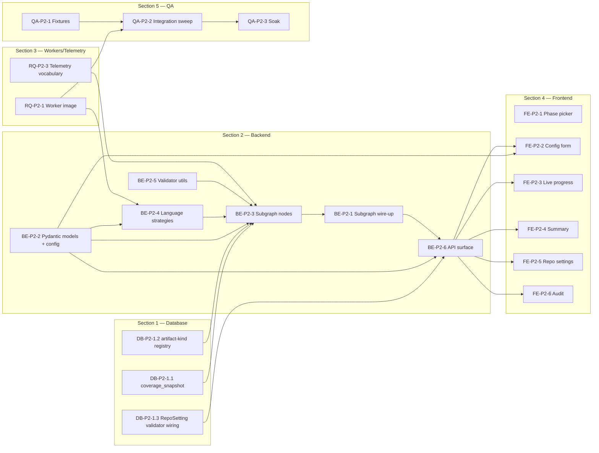

# Implementation Plan — Phase 2 (Unit Test Generator)

> Developer-ready, sequenced plan for Phase 2 (Java / Python / Rust unit-test generation). Same shape as [02_implementation_plan.md](02_implementation_plan.md) — Sections run **Database → Backend → Caching/Workers → Frontend** and stories within and across sections are ordered so every prerequisite lands before its consumer. Each task carries an Expectation and a binary Success Criteria.
>
> Scope: only the *net-new* surface for P2. The orchestrator spine, RIL, LLM Gateway, delivery layer, telemetry sinks, auth, run API, SSE, and UI shell are pre-existing from [Phase 1](PHASE-1-BLUEPRINT.md) (M0–M10). The contract freeze at M10 means **the only orchestrator change is one routing case** — see Story BE-P2-1.1.
>
> Reference architecture: [ARCHITECTURE.md](ARCHITECTURE.md). P2 node plan: [PHASE-2-BLUEPRINT.md](PHASE-2-BLUEPRINT.md). Decisions: [adr/](adr/).

---

## 0. Pre-flight Checklist (must be true before kickoff)

- [ ] M10 phase-contract freeze landed — `phase_router` already routes `unit_test_gen` to a stub.
- [ ] `RepoSetting.phase` CHECK constraint already accepts `'unit_test_gen'` (added in DB-1.4).
- [ ] `config.phases.unit_test_gen` block exists with `enabled: false` by default.
- [ ] Worker image build pipeline supports adding language toolchains (Dockerfile.worker is parametric or layered).
- [ ] Fixture repos prepared in `tests/fixtures/repos/`: one Maven Java, one pytest Python, one Cargo Rust.
- [ ] Two milestone slots booked: **P2-M1** (strategies + baseline) and **P2-M2** (subgraph + UI + GA).

If any item is unchecked, resolve it before opening Story DB-P2-1.1.

---

## Section 1: Database (PostgreSQL)

P2 adds one new table (`coverage_snapshot`) and two further additive migrations. Existing tables (`runs`, `run_artifacts`, `run_events`, `repo_settings`) absorb P2 traffic via `phase='unit_test_gen'` with no schema changes.

### Epic DB-P2-1: Schema additions for P2 outputs

#### Story DB-P2-1.1: Coverage snapshot cache table

* **Task:** Add migration `0009_coverage_snapshots` creating `coverage_snapshot(id UUID PK, repo_connection_id FK CASCADE, language text CHECK IN ('java','python','rust'), tool text, commit_sha text, overall_pct numeric(5,4), per_file jsonb, measured_at timestamptz, created_at timestamptz default now(), UNIQUE(repo_connection_id, language, commit_sha))`. Index `(repo_connection_id, language, measured_at DESC)`.
* **Expectation:** Cache is opportunistic — `compute_baseline_coverage` reads it for the current `commit_sha` and skips re-measurement if a row exists *and* `created_at > now() - interval '7 days'`. Misses are written through after measurement.
* **Success Criteria:** Round-trip test inserts a snapshot, reads it back via the SQLAlchemy model, asserts numeric precision is preserved. UNIQUE violation on duplicate `(repo, language, commit_sha)` confirmed by integration test.

#### Story DB-P2-1.2: `RunArtifact.kind` vocabulary extended for P2

* **Task:** No schema change (column is `text`). Add a vocabulary registry `src/zero_debt/db/artifact_kinds.py` listing canonical strings; CI lints that no code emits an unknown kind. New P2 kinds: `coverage_baseline_xml`, `coverage_post_xml`, `unit_test_summary_json`, `proposed_test_archive` (per-target tarball, optional).
* **Expectation:** Registry imported by `summarize_tests` and any artifact-writing code; unknown kind raises `UnknownArtifactKindError` at write time.
* **Success Criteria:** Unit test asserts attempting to write `kind="frobnicator"` raises; the canonical kinds insert without error.

#### Story DB-P2-1.3: `RepoSetting` validator wires the P2 override schema

* **Task:** In the application-side `RepoSettingValidator`, register `unit_test_gen` → `UnitTestGenInput` Pydantic model from [PHASE-2-BLUEPRINT.md](PHASE-2-BLUEPRINT.md) §3. Existing endpoint `PUT /api/repos/{id}/settings/{phase}` validates against this model.
* **Expectation:** Unknown fields rejected per existing BE-3.4 contract. Defaults populated server-side so the FE settings card can render without re-stating defaults.
* **Success Criteria:** Test PUT with `{"max_files_per_run": 10}` accepts and round-trips; PUT with `{"foo": "bar"}` returns 422 listing `foo` as unknown; PUT with `{"coverage_target_delta": 1.5}` returns 422 (out of range).

---

## Section 2: Backend (FastAPI + LangGraph)

### Epic BE-P2-1: Subgraph wiring (the only orchestrator-facing change)

#### Story BE-P2-1.1: Replace `unit_test_gen` stub subgraph with real subgraph

* **Task:** In `src/zero_debt/graph/subgraphs/unit_test.py`, replace the M10 stub `compile_subgraph()` with the real implementation built in BE-P2-3. Routing in `graph/routing.py` is unchanged — it already maps `AgentPhase.UNIT_TEST_GEN` to this module. Also create `templates/pr_body_unit_test_gen.md.j2` (per-language coverage table + per-target disposition table); verify `config/zero-debt.yaml` uses `pr_template_paths` (map) not the deprecated `pr_template_path` key (ARCHITECTURE.md §2.10 B1 fix).
* **Expectation:** Public function signature `compile_subgraph(deps: SubgraphDeps) -> CompiledStateGraph` is preserved. `deps` is the existing dataclass exposing `llm_gateway`, `language_strategy_registry`, `git_tool`, `patch_tool`, `fs_tool`, `telemetry`. No edits to `pre_nodes.py`, `post_nodes.py`, `orchestrator.py`, or `state.py`.
* **Success Criteria:** Importing the module, calling `compile_subgraph(deps)`, and invoking the returned graph against a seeded `ZeroDebtState` reaches END for the no-op case (`targets_total=0`). The diff for this story touches no orchestrator-spine file. `open_pull_request` post-node resolves the correct Jinja2 template via `config.github.pr_template_paths["unit_test_gen"]` and renders without error on a sample `UnitTestSummaryReport`.

#### Story BE-P2-1.2: Phase enable flag + capability gate

* **Task:** Flip `phases.unit_test_gen.enabled` to `true` in `config/zero-debt.yaml`. The API already rejects `POST /api/runs` with `phase=unit_test_gen` when `enabled=false`; flipping is sufficient.
* **Expectation:** Disabled phases return 400 with code `phase_disabled`. Enabling does not retroactively enqueue anything.
* **Success Criteria:** With flag off, `POST /api/runs {phase:unit_test_gen}` returns 400; with flag on, the same call returns 202 with a `run_id`.

### Epic BE-P2-2: Pydantic contracts and configuration

#### Story BE-P2-2.1: Add P2 Pydantic models

* **Task:** Implement every model from PHASE-2-BLUEPRINT §3 under `src/zero_debt/phases/unit_test_gen/models.py`: `UnitTestGenInput`, `LanguagePlan`, `TestTarget`, `TestContext`, `ProposedTestFile`, `TestProposal`, `ValidationGateResult`, `ValidationReport`, `TestRunResult`, `AppliedTest`, `SkippedTarget`, `CoverageSnapshot`, `CoverageDeltaReport`, `UnitTestSummaryReport`. All Pydantic v2 with strict typing and the constraints listed in the blueprint.
* **Expectation:** `model_json_schema()` produces a JSON Schema acceptable as `LLMRequest.json_schema` for the Anthropic provider (objects + enums only, no `$ref` cycles). `ProposedTestFile` uses a discriminated union on `write_mode` so `content` xor `unified_diff` is enforced at the schema level.
* **Success Criteria:** `pytest tests/unit/phases/unit_test_gen/test_models.py` passes assertions for: Pydantic round-trip, JSON-schema generation produces a flat schema, `write_mode="create"` with `content=None` raises validation error, `write_mode="diff"` with `unified_diff=None` raises.

#### Story BE-P2-2.2: Phase config schema

* **Task:** Extend `config.phases.unit_test_gen` in `Settings` with all keys driving defaults that the FE/API expose: `enabled`, `coverage_target_delta`, `max_files_per_run`, `max_files_per_language`, `per_file_iteration_cap`, `default_frameworks: dict[lang, framework]`, `default_coverage_tools: dict[lang, tool]`, `mutate_production_code` (deployment-wide hard ceiling), `branch_strategy`, `token_budget` (override of run-level budget for P2 runs), `worker_test_timeout_sec_overrides: dict[lang, int]`.
* **Expectation:** YAML loads cleanly under the existing `SecretsInYamlError` checker. `mutate_production_code` set to `false` in YAML acts as a hard cap — a per-run override of `true` is rejected at API enqueue with code `production_mutation_forbidden`.
* **Success Criteria:** Test loads a sample YAML and asserts `Settings.config.phases.unit_test_gen.coverage_target_delta == 0.10`. API integration test asserts that enqueuing with `mutate_production_code=true` against a YAML where that key is `false` returns 422.

### Epic BE-P2-3: Subgraph nodes (one story per node — sized for one developer-day each except where noted)

All nodes live under `src/zero_debt/phases/unit_test_gen/nodes/`. Each node is an `async def node_<name>(state: ZeroDebtState, deps: SubgraphDeps) -> ZeroDebtState` that mutates `phase_input`/`phase_output` and never reaches outside `deps`. Every node emits a structured progress event via `deps.telemetry.run_event(...)` on entry and exit.

#### Story BE-P2-3.1: `detect_languages_and_frameworks` node

* **Task:** Implement node logic per PHASE-2-BLUEPRINT §2 row 1. Builds `LanguagePlan` per requested language using strategy registry. Logs and drops languages with no detected source.
* **Expectation:** If `phase_input.languages` is None, derive from RIL languages whose share ≥ 5%. Always-deterministic ordering: `["java","python","rust"]` intersected with detected. Raises `NoLanguagesEligibleError` if zero languages remain — caught upstream and converted to `status=succeeded, targets_total=0`.
* **Success Criteria:** Unit test against a synthetic RIL outline with all three languages produces three plans; one with only Python produces one plan; one with no plans triggers the success-empty path (asserted at the subgraph compose level).

#### Story BE-P2-3.2: `select_target_files` node + ranking algorithm

* **Task:** Walk `repo_outline.files` filtered by `target_file_globs`. Exclude test directories via `LanguagePlan.test_roots` plus a hard-coded blacklist of generated dirs. For each candidate, compute `complexity_score` (cyclomatic via tree-sitter) and `churn_score` (commits in last 90 days from `git log --since`). `uncovered_loc` derived from baseline coverage's `per_file` map after step 3 — but step 2 must run before step 3, so this story implements a two-pass design: step 2 emits *all* eligible targets without `uncovered_loc`, and a thin pass after step 3 fills in `uncovered_loc` and re-ranks.
* **Expectation:** Deterministic for a given commit. Cap by `max_files_per_run` and `max_files_per_language`. POSIX globbing; case-sensitive on Linux. The two-pass design is encoded as a helper `attach_coverage_to_targets()` invoked inline at the end of `compute_baseline_coverage`.
* **Success Criteria:** Test on a synthetic 100-file repo returns a ranked list whose order matches a hand-computed expected ordering byte-for-byte. Same input twice → same output. Caps respected.

#### Story BE-P2-3.3: `compute_baseline_coverage` node

* **Task:** For each `LanguagePlan`, call `LanguageStrategy.run_coverage_baseline(repo, plan)`. Read-through cache via `coverage_snapshot` table (Story DB-P2-1.1). On strategy exception → drop the language with reason `coverage_unmeasurable`, append warning, continue.
* **Expectation:** Cache lookup keyed by `(repo_connection_id, language, current_commit_sha)`. `current_commit_sha` is whatever HEAD is in the cloned workspace — the run does not modify HEAD before this point. Cache writes run *after* measurement succeeds.
* **Success Criteria:** Integration test against the Java fixture: first run misses cache and inserts; second run hits cache and skips the subprocess. Forcing a strategy exception drops only the affected language.

#### Story BE-P2-3.4: `pick_next_target` and `loop_controller`

* **Task:** Pure-logic nodes. `pick_next_target` advances the cursor and writes `current_target`. `loop_controller` evaluates: cursor exhausted, iteration cap, consecutive-failure cap (default 3), token budget, coverage-delta target estimate (sum of `target.uncovered_loc * (test_passed?1:0)` ÷ total LOC).
* **Expectation:** Coverage estimate is *optimistic* — it assumes any passing test exercises 100% of the target's uncovered LOC. `finalize_coverage_measurement` produces the authoritative number. The estimator's only job is early-exit.
* **Success Criteria:** Synthetic loop with 10 targets and a delta target met after target 4 stops at 4. With a budget breach mid-target, stops at the next iteration boundary.

#### Story BE-P2-3.5: `build_test_context` node

* **Task:** Compose `TestContext` per blueprint §3. Symbol neighbors via `repo_outline.module_graph`. Exemplars: up to 2 existing test files in the same package — picked by simple heuristic (shortest filename in same module). Token-bound trim from neighbors first, exemplars second, target source last (target source is non-negotiable).
* **Expectation:** `forbidden_paths` list = production paths under the target's source root, used by validator gate 3 as a redundant defense. tiktoken-compatible counter for trimming.
* **Success Criteria:** Test on a 5k-LOC fixture file fits under `token_budget_hint=6000`; trimming logs `tokens_before/tokens_after` warning. With no exemplar tests in the package, the field is `[]` and the LLM call still proceeds.

#### Story BE-P2-3.6: `propose_tests` node (LLM call)

* **Task:** Compose three-layer prompt per blueprint §7 and call `deps.llm_gateway.complete(LLMRequest(model_id=phase_input.llm_model_role, json_schema=TestProposal.model_json_schema(), ...))`. On JSON-schema error, the gateway's existing one-shot retry kicks in (BE-5.2). Token usage accumulated into `state.llm_token_usage`.
* **Expectation:** System and repository layers tagged with `cache_control` to enable Anthropic prompt caching. Retry attempts past `per_file_iteration_cap` raise `MaxIterationsExceeded`, caught by the parent edge to route to `mark_target_skipped`.
* **Success Criteria:** Integration test with a recorded Anthropic response (via `respx`) returns a valid `TestProposal` with two files; a malformed first response retries once and succeeds; two consecutive malformed responses raise `LLMSchemaError` and the subgraph routes to skip.

#### Story BE-P2-3.7: `validate_test` node + six gates

* **Task:** Implement gates 1–6 from PHASE-2-BLUEPRINT §5 in this exact order (cheapest first; production_firewall before lint to avoid running lint on rejected production edits). Each gate produces a `ValidationGateResult`.
* **Expectation:** Gates short-circuit on first failure for performance, but the failure reason is structured and stable. The lint-delta gate runs in a *cloned scratch* of the worktree (`git worktree add /tmp/.zd-validate-<run> HEAD`) so the live workspace is unaffected. Scratch worktree torn down in `finally`.
* **Success Criteria:** Hand-crafted unit tests: a clean Java JUnit5 file passes all gates; a file modifying production code triggers `production_firewall_violated`; a file with a parse error triggers `ast`; a file that adds `// TODO` triggers nothing (warnings allowed); a file that introduces a clippy `error` triggers `lint_delta`.

#### Story BE-P2-3.8: `apply_test` node

* **Task:** Apply each `ProposedTestFile` via `PatchTool`. For `write_mode="create"`, ensure parent dirs exist. For `write_mode="diff"`, dry-run the diff again then apply. Compute `patch_hash = sha256(normalized_diff_or_content)` and write to `phase_output.applied_tests`.
* **Expectation:** Atomic per file — if the second of three files fails to write, the first is rolled back via `GitTool.checkout -- <path>` before raising. No git commit here — the post-node does that.
* **Success Criteria:** Test with a 3-file proposal where file 2 is unwritable (perms simulated) leaves the working tree at HEAD for files 1 and 2 untouched; a clean 3-file write produces 3 entries in `applied_tests`.

#### Story BE-P2-3.9: `run_test_suite` node

* **Task:** Resolve `target_id` via `LanguageStrategy.parse_target_id(target)`. Invoke `LanguageStrategy.run_selective_test(repo, plan, target_id)`. Wrap in `asyncio.wait_for(timeout=plan.test_timeout_sec)`. Capture stdout+stderr to a tmpfile; parse via the strategy's parser into `TestRunResult`.
* **Expectation:** Subprocess spawned via the existing `Subprocess` helper that enforces arg-arrays, no shell, jailed cwd. Returns a `TestRunResult` even on timeout (`timed_out=True, exit_code=-1`). Failure traces truncated to 4 KB per failure.
* **Success Criteria:** Java fixture: a passing test reports `passed≥1, failed=0`. A deliberately-broken test reports `failed≥1` with a non-empty `failures[].message`. A test that infinite-loops triggers `timed_out=True` within `plan.test_timeout_sec + 5s`.

#### Story BE-P2-3.10: `rollback_target` and `mark_target_skipped`

* **Task:** `rollback_target` calls `GitTool.checkout -- <paths>` for the most recent applied target; for `write_mode="create"` files, also `os.unlink` since checkout doesn't remove untracked. `mark_target_skipped` appends to `phase_output.skipped_targets` with structured reason and any captured failure detail.
* **Expectation:** Rollback is best-effort — on failure, log a warning, do not raise (the run shouldn't abort because cleanup hiccupped). Skipped-target events flushed to telemetry.
* **Success Criteria:** Rolling back a 2-file create then asserting the working tree matches HEAD. Skipped-target document in Mongo telemetry has `reason in {validation_failed, tests_red, ambiguous_proposal, ...}` from the closed enum.

#### Story BE-P2-3.11: `finalize_coverage_measurement`

* **Task:** Per language, call `LanguageStrategy.run_full_coverage(repo, plan)` on the final tree. Compute deltas vs. baseline. Produce `CoverageDeltaReport`. **Do not write a post-run snapshot to the `coverage_snapshot` cache** — only the baseline snapshot (written in BE-P2-3.3) is cached, keyed by the original HEAD commit SHA. The post-run measurement is unique to this run's applied tests and will be stale the moment the branch diverges.
* **Expectation:** Strategy errors caught and converted to `measurement_errors` in the report; the run does not fail. Total node time bounded by sum of language coverage timeouts; loop_controller is responsible for ensuring time budget remains when reaching this node.
* **Success Criteria:** Java fixture run with one applied test produces a `CoverageDeltaReport` with `delta_overall_pct > 0` and the file under test in `delta_per_file`. Forcing a tarpaulin error returns a report with `measurement_errors=["tarpaulin: ..."]` and the run still reaches END.

#### Story BE-P2-3.12: `summarize_tests`

* **Task:** Build `UnitTestSummaryReport` from `phase_output.applied_tests`, `phase_output.skipped_targets`, `phase_output.coverage_delta`, token usage, timings. Decide `status` (`SUCCEEDED`/`PARTIAL`/`FAILED`). Set `phase_output["delivery_required"] = len(applied_tests) > 0 and not phase_input.get("dry_run", False)` and `phase_output["work_branch_hint"] = f"zerodebt/p2/{run_id}"` for the `post_phase_normalize` gate. Delete per-run Python venv at `/opt/zerodebt/venv/{run_id}` if it exists. Serialize summary as `RunArtifact(kind="unit_test_summary_json")`.
* **Expectation:** `status` decision rule documented in a docstring. `phase_output["delivery_required"]` is the canonical bool read by `post_phase_normalize` — nothing else from this node is phase-specific to the post-nodes.
* **Success Criteria:** Three integration cases (all-pass, mixed, all-fail) produce `SUCCEEDED`/`PARTIAL`/`FAILED`. With `dry_run=True`, `delivery_required=False` regardless of `applied_tests`. Artifact row exists with parseable JSON. Venv directory absent after node completes.

#### Story BE-P2-3.13: `deliver_per_language` node

* **Task:** Implement the node that is only reached when `phase_input.branch_strategy == "per_language"` (see PHASE-2-BLUEPRINT §1 mermaid and §2 row 15). For each language with ≥1 applied test: (a) create branch `zerodebt/p2/{run_id}/{lang}` via `GitTool`, (b) stage only that language's test files, (c) commit + push via `GitTool`/`GitHubTool`, (d) open a PR via `GitHubTool` using `config.github.pr_template_paths["unit_test_gen"]`, filtered to that language's applied targets, (e) record `phase_output["pr_urls"][lang] = pr_url`. After all languages are processed, set `phase_output["delivery_required"] = False` so shared post-nodes skip delivery.
* **Expectation:** If a language's branch push fails, record the error in `phase_output.skipped_targets` with `reason="delivery_failed"` and continue with remaining languages. Never writes to the default branch (ADR-0010 enforced by `GitHubTool`).
* **Success Criteria:** Java+Python run with `branch_strategy=per_language` produces two distinct branches and two distinct PRs on the test repo; `phase_output["delivery_required"]` is `False`; `open_pull_request` post-node is a no-op (assertion: no additional PR is opened).

### Epic BE-P2-4: Language strategies (the heart of P2)

Each strategy is a stateful but immutable class registered in `LanguageStrategyRegistry`. Strategies own their subprocess invocations and parser logic.

#### Story BE-P2-4.1: `LanguageStrategy` base + registry + tests

* **Task:** Implement the ABC from PHASE-2-BLUEPRINT §4 verbatim under `src/zero_debt/phases/unit_test_gen/strategies/base.py`. Registry exposes `get(lang) -> LanguageStrategy` and `available() -> list[LangCode]`. Registration via decorator `@register_strategy("java")`.
* **Expectation:** ABC enforces all abstract methods at instantiation; registry asserts each registered class declares matching `code` attribute.
* **Success Criteria:** A stub `FakeStrategy` registered under `"java"` is retrievable via `get("java")`; instantiating an incomplete subclass raises `TypeError`.

#### Story BE-P2-4.2: Java strategy — discovery + commands

* **Task:** Implement `JavaStrategy.discover_build_system`, `discover_test_roots`, `expected_test_path`, `style_block`, `framework_imports`, and the cmd templates from PHASE-2-BLUEPRINT §4.1. Multi-module Maven via `pom.xml` `<modules>` parser; multi-project Gradle via `settings.gradle[.kts]` regex. No actual build invocation in this story.
* **Expectation:** Strategy is purely deterministic from the working tree. Expected-test-path collisions (target file already has a `*Test.java`) → `expected_test_path` returns the existing path so the validator gate 6 prevents method-name dupes rather than file-level overwrite.
* **Success Criteria:** Test fixtures: single-module Maven repo returns one module; multi-module returns N. Gradle Kotlin-script `settings.gradle.kts` parses correctly. `expected_test_path("src/main/java/com/acme/Foo.java")` returns the canonical Test path.

#### Story BE-P2-4.3: Java strategy — coverage runner (JaCoCo)

* **Task:** Implement `run_coverage_baseline`, `run_full_coverage`, `run_selective_test` for Java. Maven path uses `mvn -B -q jacoco:report`; Gradle uses `./gradlew jacocoTestReport`. Selective via `-Dtest=` or `--tests`. JaCoCo XML parser builds `CoverageSnapshot.per_file` keyed by repo-relative path (resolved by joining `<sourcefile>` with module's `src/main/java`).
* **Expectation:** Subprocess invocations honor `MAVEN_OPTS`/`GRADLE_OPTS` from worker env; offline-mode mirror used if `~/.m2/settings.xml` present in the worker image. Working dir = repo root for single-module, module dir for multi-module selective runs.
* **Success Criteria:** Java fixture (Maven) baseline returns `overall_pct` consistent with `mvn jacoco:report` run by hand (within 0.5%). Selective run of one new test exits 0 and returns `passed=1`.

#### Story BE-P2-4.4: Python strategy — discovery + commands

* **Task:** Implement Python equivalents of BE-P2-4.2 per PHASE-2-BLUEPRINT §4.2. Detect existing test layout (`tests/` root vs. sibling) by counting matches and going with majority.
* **Expectation:** `pyproject.toml` parsed via `tomllib` (Python 3.11+ stdlib). Source-root inference falls back to walking for top-level `__init__.py` if no manifest hint.
* **Success Criteria:** Fixture pytest project with `tests/` root produces `test_roots=["tests"]`; sibling-style fixture produces `test_roots` equal to source roots; mixed → majority wins, decision logged.

#### Story BE-P2-4.5: Python strategy — coverage runner (coverage.py)

* **Task:** Implement Python coverage and test runners per blueprint. Per-run venv at `/opt/zerodebt/venv/<run_id>`; deps installed once via `poetry install --no-root` if `poetry.lock` else `pip install -e .[test]` else `pip install -r requirements*.txt`. Cache the venv path on the strategy instance for subsequent calls within the same run; **deleted by `summarize_tests`** (the terminal subgraph node) before it exits — never by the shared post-nodes, which must remain phase-agnostic (ARCHITECTURE §4.4).
* **Expectation:** Fail-soft on `pip install` errors → strategy raises `BootstrapFailed`; node converts to `coverage_unmeasurable` for Python. coverage.py JSON parsed for per-file pct.
* **Success Criteria:** Python fixture baseline returns expected pct; selective `pytest path::test_func` returns `passed=1`. Forcing a missing dep returns `BootstrapFailed` and the run continues with other languages.

#### Story BE-P2-4.6: Rust strategy — discovery + commands

* **Task:** Implement Rust equivalents per PHASE-2-BLUEPRINT §4.3. Workspace detection via `[workspace]` in root `Cargo.toml`. For workspaces, iterate `members` (glob-expanded).
* **Expectation:** `expected_test_path` returns the *source path itself* when the strategy chooses in-source `mod tests`, signaling to the validator that a diff (not a create) is expected. Validator gate 3 has Rust-specific logic in BE-P2-3.7.
* **Success Criteria:** Single-crate fixture lists one source root; workspace fixture lists N. Glob-based members (`crates/*`) expand correctly.

#### Story BE-P2-4.7: Rust strategy — coverage runner (tarpaulin / llvm-cov)

* **Task:** Default `tarpaulin`. Selective: `cargo test -- --exact <target_id>`. Tarpaulin JSON parser → `CoverageSnapshot`. `llvm-cov` alt path gated on `coverage_tool_overrides.rust == "llvm-cov"`.
* **Expectation:** Long-running tarpaulin runs respected by node-level timeout (10 min default). `cargo` invoked with `CARGO_NET_OFFLINE=true` if `vendor/` exists.
* **Success Criteria:** Rust fixture baseline produces a non-empty `per_file`. Selective test run returns a parseable result. Forcing tarpaulin to fail flips to `coverage_unmeasurable` cleanly.

### Epic BE-P2-5: Validator support utilities

#### Story BE-P2-5.1: Tree-sitter parsers wired for Java / Python / Rust

* **Task:** Confirm `tree-sitter-languages` already provides grammars for `java`, `python`, `rust` (it does). Add a thin `phases/unit_test_gen/validators/ast.py` exposing `parse_or_fail(language, source) -> None` raising `AstParseError` if any ERROR node found.
* **Expectation:** Parser instances cached at module load; thread-safe under asyncio (each call uses a fresh `Parser().parse` invocation but shared `Language`).
* **Success Criteria:** Valid Java/Python/Rust files parse without raising; deliberately broken files raise with a stable error code.

#### Story BE-P2-5.2: Lint-delta runner

* **Task:** `phases/unit_test_gen/validators/lint_delta.py` exposes `compute_delta(scratch_repo, language) -> int` returning `(post_errors - pre_errors)`. Per-language commands: `ruff check --output-format json`, `cargo clippy --message-format json -- -D warnings`, `mvn -B -q checkstyle:check` (only if `checkstyle.xml` exists; else returns 0 by convention).
* **Expectation:** Output streamed and parsed line-by-line for JSON-lines tools; errors counted by severity. Tools missing → return 0 + warning (don't fail validation if lint isn't even configured).
* **Success Criteria:** Hand-crafted before/after pair: adding a clean test → delta=0. Adding a test with an `unused_import` → delta≥1. No checkstyle config + Java patch → delta=0 and a warning event.

#### Story BE-P2-5.3: Production-firewall checker

* **Task:** `phases/unit_test_gen/validators/production_firewall.py::check(plan, proposed_files, repo)`. For `write_mode="create"`, every path must resolve under one of `plan.test_roots`. For `write_mode="diff"`, parse the unified diff and ensure every hunk's target file is either (a) under a test root, or (b) a Rust source file *and* every changed line is inside a `#[cfg(test)] mod` block (tree-sitter range query).
* **Expectation:** Symlink-resolves before path comparison. Path traversal attempts (`../`) rejected with `production_firewall_violated:traversal`.
* **Success Criteria:** Java create under `src/test/java/...` passes; under `src/main/java/...` fails. Rust diff inside `mod tests` passes; outside fails. Symlink trick blocked.

### Epic BE-P2-6: Run API surface for P2 input

#### Story BE-P2-6.1: `POST /api/runs/upload` artifact upload (reused; verify P2 path)

* **Task:** P2 has *no* report upload (unlike P1). Verify the existing `POST /api/runs/upload` is *not* invoked for P2 by FE; if it is, return 400 with `phase_no_artifact_input`.
* **Expectation:** No new endpoint. Negative test only.
* **Success Criteria:** Calling upload with a P2 run-creation flow returns 400 with the documented code.

#### Story BE-P2-6.2: P2 input validation in `POST /api/runs`

* **Task:** Existing endpoint validates `input_payload` against the phase's Pydantic input model. Wire `unit_test_gen` → `UnitTestGenInput`. The `mutate_production_code=true` ceiling check (Story BE-P2-2.2) lives here.
* **Expectation:** Re-validate at enqueue, not just at the subgraph boundary, so the error surfaces synchronously to the user.
* **Success Criteria:** Bad enum value returns 422; over-cap `max_files_per_run` returns 422; valid payload returns 202.

#### Story BE-P2-6.3: `GET /api/runs/{id}/coverage` (P2-specific detail)

* **Task:** New endpoint returning `phase_output.coverage_delta` from a terminal P2 run, sourced from the `unit_test_summary_json` artifact (cheaper than fetching full state). Returns 409 if run isn't terminal, 404 if not P2, 403 if not owner/admin.
* **Expectation:** Read-through the artifact rather than re-querying LangGraph state. Cache-Control: `private, max-age=300` since the data is immutable post-completion.
* **Success Criteria:** Endpoint returns the per-language `CoverageDeltaReport` map for a completed P2 run; returns 409 for an in-flight run; returns 404 for a P1 run.

---

## Section 3: Caching & Background Processing (Redis + Arq)

### Epic RQ-P2-1: Worker image extension

#### Story RQ-P2-1.1: Add JDK + Maven + Gradle wrapper support to `Dockerfile.worker`

* **Task:** Layered Dockerfile. Base layer `python:3.11-slim` (already has Python tooling from M0). Add: `apt-get install -y openjdk-17-jdk-headless maven`. Gradle is invoked via project's `gradlew`, so no install needed beyond JDK. Set `JAVA_HOME=/usr/lib/jvm/java-17-openjdk-<arch>`.
* **Expectation:** Image tagged `zero-debt/worker:dev` continues to fit under 2 GB. Image size tracked in CI via `docker image inspect` — gate at 1.8 GB warning, 2.0 GB error.
* **Success Criteria:** `docker build -f Dockerfile.worker .` succeeds; `docker run zero-debt/worker:dev java -version` prints OpenJDK 17; image size in CI report is ≤ 1.8 GB.

#### Story RQ-P2-1.2: Add Rust toolchain to worker image

* **Task:** Add: `curl https://sh.rustup.rs -sSf | sh -s -- -y --default-toolchain stable --profile minimal --component clippy rustfmt && cargo install cargo-tarpaulin --locked`. PATH updated for `rustup`/`cargo`.
* **Expectation:** Tarpaulin binary cached as a layer to avoid rebuild. Image still under 2 GB.
* **Success Criteria:** `docker run zero-debt/worker:dev cargo --version` prints stable; `cargo tarpaulin --version` prints; size ≤ 2 GB.

#### Story RQ-P2-1.3: Add Python coverage tooling

* **Task:** In the worker image's base venv, install `coverage[toml]>=7.4` and `pytest>=8.0` plus a `pyproject.toml`-aware shim. Per-run venvs are *project* venvs (Story BE-P2-4.5); the worker base venv is only used for coverage tooling on bare-bones repos.
* **Expectation:** No version pin conflicts with API/worker app deps (separate venv).
* **Success Criteria:** Worker image `coverage --version` and `pytest --version` print expected versions.

#### Story RQ-P2-1.4: CI image-size gate

* **Task:** GitHub Action step that runs after `docker build`, parses `docker image inspect -f '{{.Size}}'`, and fails the job if > 2 GB or warns if > 1.8 GB.
* **Expectation:** Threshold values in a single `.github/workflows/_image_thresholds.env` file referenced from the workflow.
* **Success Criteria:** Manually padding the worker image with a 500 MB file fails the job; reverting passes.

### Epic RQ-P2-2: Concurrency model (no changes; verify)

#### Story RQ-P2-2.1: Verify P2 honors per-user / per-repo caps

* **Task:** Integration test only. Submit two P2 runs concurrently against the same repo with `per_repo_concurrent_runs=1`; assert second returns 429.
* **Expectation:** Existing RQ-1.3 implementation is phase-agnostic — just confirm with a P2 run.
* **Success Criteria:** Test green; no code changes needed.

### Epic RQ-P2-3: Telemetry vocabulary for P2

#### Story RQ-P2-3.1: Mongo `run_events` event-kind vocabulary additions

* **Task:** Register new event kinds in the central `event_kinds.py` registry (analogous to artifact kinds — DB-P2-1.2): `target_selected`, `coverage_baseline_complete`, `proposal_received`, `validation_failed`, `tests_red`, `target_succeeded`, `target_skipped`, `coverage_delta_complete`. Each kind has a fixed payload schema (Pydantic) for downstream replay.
* **Expectation:** Event payloads validated at emit time; unknown kinds raise. Schema versions tracked via `schema_version: int` field.
* **Success Criteria:** Emitting each kind from a unit test inserts a Mongo doc that round-trips through the schema. Unknown kind raises.

#### Story RQ-P2-3.2: LLM archive doc shape unchanged; `node="propose_tests"` lands

* **Task:** Verification test only. Run a P2 fixture; assert the `llm_interactions` collection has `node="propose_tests"` documents with token usage populated.
* **Expectation:** No code changes — BE-5.3 already archives every call.
* **Success Criteria:** Mongo query returns ≥1 document per LLM call made by the run.

---

## Section 4: Frontend (Angular 20)

### Epic FE-P2-1: Phase picker — enable P2 card

#### Story FE-P2-1.1: Enable `unit_test_gen` in the phase picker

* **Task:** Remove the `disabled` flag and `preview` chip on the P2 card in `<phase-picker>` (`web/src/app/features/runs/phase-picker.component.ts`). Update the card copy from the M10 stub to: title "Unit Test Generator (Java / Python / Rust)", subtitle "Generate JUnit / pytest / cargo-test tests with coverage delta tracking."
* **Expectation:** Card click navigates to `/new-run/unit-test-gen?repo={id}` (route added in next story).
* **Success Criteria:** Phase picker renders the P2 card as enabled; clicking it routes to the new form.

### Epic FE-P2-2: Configure form

#### Story FE-P2-2.1: `<unit-test-gen-form>` component

* **Task:** New standalone component at `web/src/app/features/runs/unit-test-gen-form.component.ts`. Fields aligned to `UnitTestGenInput`: language multiselect (defaults from repo's RIL languages), target globs (chip input), coverage target % slider (1–25, displays as `+X pp`), max files per run (number, 1–500), per-file iteration cap, framework dropdown per selected language, coverage tool dropdown per selected language (Rust only — `tarpaulin` / `llvm-cov`), branch strategy radio (`per_run` / `per_language`), `mutate_production_code` checkbox (disabled if YAML ceiling forbids it; tooltip explains why), dry-run checkbox, model role dropdown.
* **Expectation:** Form built with Angular Reactive Forms; submission posts to `POST /api/runs` with `phase=unit_test_gen` and the validated payload. Concurrency-cap 429 surfaced as a toast. Server 422 mapped to inline field errors via the response's `loc` paths.
* **Success Criteria:** Submitting the form for a Java+Python repo with valid inputs lands on `/runs/{id}` (live progress) within 2 s; submitting with a too-large `max_files_per_run` shows the inline error pointing to that field; submitting with `mutate_production_code=true` against a deployment that forbids it shows a toast with the documented error code.

#### Story FE-P2-2.2: Per-language framework / coverage-tool detection helpers

* **Task:** When a language is selected, fetch `GET /api/repos/{id}` (already includes `language_mix` and `frameworks`) and pre-fill the framework dropdown with the detected default. If multiple frameworks coexist (e.g., JUnit 4 + JUnit 5), show a warning banner and force the user to choose.
* **Expectation:** Read-only repos (deleted/disconnected) gracefully fall back to defaults from `config.phases.unit_test_gen.default_frameworks`.
* **Success Criteria:** Java fixture with both JUnit 4 and JUnit 5 imports renders the warning; selecting one removes it.

### Epic FE-P2-3: Run progress — node timeline updates

#### Story FE-P2-3.1: Map P2 nodes into the existing `<run-progress>` timeline

* **Task:** The existing run-progress component reads node names from SSE events. Add the P2 node names from PHASE-2-BLUEPRINT §1 to the client-side `NODE_METADATA` registry (icons + display names). Add per-language sub-progress: when `coverage_baseline_complete` event arrives with a `language` field, render a per-language sub-row showing baseline pct.
* **Expectation:** Sub-row collapsible; defaults to expanded for the language currently being processed.
* **Success Criteria:** A live P2 run shows the timeline rows in order; `coverage_baseline_complete` events render the sub-rows with the right percentages.

#### Story FE-P2-3.2: LLM-streaming panel handles `propose_tests` calls

* **Task:** No code change — the existing streaming panel keys off `node="propose_tests"`. Verification only.
* **Expectation:** Panel header shows "Proposing tests for {target.source_path}".
* **Success Criteria:** Live test confirms the header updates per target.

### Epic FE-P2-4: Run summary — coverage delta visualization

#### Story FE-P2-4.1: P2 summary screen variant

* **Task:** Extend `<run-summary>` to detect `phase=unit_test_gen` and render a P2-specific section: per-language coverage delta cards (baseline → post, with delta in pp and color-coded), per-target disposition table (target path, language, status, files added/modified, test count, run time), top failures section.
* **Expectation:** Coverage delta cards reuse the existing stat-tile component. Disposition table virtualized for large runs (>500 rows).
* **Success Criteria:** Three seeded runs (Java-only, Python-only, mixed) render correctly; a 1000-target run remains responsive.

#### Story FE-P2-4.2: Coverage delta chart

* **Task:** Stacked horizontal bar per language showing covered vs. uncovered LOC, before and after, with a callout for files newly fully-covered.
* **Expectation:** Chart sourced from `GET /api/runs/{id}/coverage` (Story BE-P2-6.3). No 3rd-party chart library — render with inline SVG to avoid bundle size hit.
* **Success Criteria:** Visual matches mockup within ±5 px tolerance; switching language tab re-renders without flicker.

### Epic FE-P2-5: Repo settings — P2 override card

#### Story FE-P2-5.1: P2 settings card on `RepoDetailScreen`

* **Task:** Add the P2 accordion row to `<repo-detail>` mirroring the P1 card. Fields: enabled toggle (calls `PUT /api/repos/{id}/settings/unit_test_gen` with `{enabled: true|false}`), default languages, default coverage delta target, default max files. PATCH on field blur (debounced 500 ms) — same pattern as P1.
* **Expectation:** Card collapsed by default; expansion preserves form state across collapse/expand. "Reset to defaults" link clears `config_override` to `{}`.
* **Success Criteria:** Toggling the P2 row, changing a default, refreshing the page → values persist; "Reset to defaults" restores the global YAML defaults visible in the UI.

### Epic FE-P2-6: Audit screen — surface P2-specific events

#### Story FE-P2-6.1: Audit filters include new P2 event kinds

* **Task:** Add the kinds from Story RQ-P2-3.1 to the audit screen's filter dropdown. Render a per-kind icon and a one-line human summary in the timeline.
* **Expectation:** Unknown kinds (forward-compat) render as a generic gray row rather than crashing the screen.
* **Success Criteria:** Audit screen for a P2 run shows the new event types interleaved with the existing ones in chronological order; filtering by `target_skipped` returns only those rows.

---

## Section 5: Testing & QA

### Epic QA-P2-1: Fixture repos

#### Story QA-P2-1.1: Java fixture

* **Task:** Add `tests/fixtures/repos/java-maven-sample/` — a minimal Maven project with one production class `Calculator.java`, one existing trivial test, `pom.xml` configured for JUnit 5 + JaCoCo. Baseline coverage ~30%.
* **Expectation:** Self-contained; no external deps beyond what Maven Central provides.
* **Success Criteria:** `mvn -B -q jacoco:report` from the fixture root succeeds; baseline overall pct ≈ 30%.

#### Story QA-P2-1.2: Python fixture

* **Task:** `tests/fixtures/repos/python-pytest-sample/` — a Poetry project with one module + one trivial test, `pyproject.toml` with pytest + coverage configured. Baseline ~25%.
* **Expectation:** Locked deps via `poetry.lock`.
* **Success Criteria:** `poetry install --no-root && poetry run coverage run -m pytest && poetry run coverage report` produces ~25% baseline.

#### Story QA-P2-1.3: Rust fixture

* **Task:** `tests/fixtures/repos/rust-cargo-sample/` — a single-crate Cargo project with one library module + one trivial test. Baseline ~20%.
* **Expectation:** `Cargo.lock` committed.
* **Success Criteria:** `cargo tarpaulin --skip-clean` produces ~20% baseline.

### Epic QA-P2-2: Integration test sweep

#### Story QA-P2-2.1: End-to-end happy-path test per language

* **Task:** Three integration tests under `tests/integration/phase2/`: spin up the full compose stack via `compose.test.yml`, submit a P2 run against each fixture, assert run terminates `SUCCEEDED` with coverage delta > 0 and the summary artifact present.
* **Expectation:** Tests use recorded LLM responses via `respx` to keep CI deterministic and free.
* **Success Criteria:** All three tests green in CI within 8 minutes total.

#### Story QA-P2-2.2: Error-matrix coverage

* **Task:** One test per row in PHASE-2-BLUEPRINT §6. Reuse fixtures with targeted mutations (e.g., a Java test that infinite-loops; a Python test that imports a non-existent symbol; a Rust diff that touches production code).
* **Expectation:** Each test asserts the expected `SkippedTarget.reason` and run-level `status`.
* **Success Criteria:** All error-matrix tests green; CI report shows a 1:1 mapping between table rows and test functions.

#### Story QA-P2-2.3: Resumability test

* **Task:** Submit a Java run, kill the worker after `apply_test` for target 2 of 5, restart the worker, assert the run completes from target 3 without re-applying targets 1–2.
* **Expectation:** Detection via `patch_hash` matching in `phase_output.applied_tests` after replay.
* **Success Criteria:** Test green; final run state contains 5 applied tests and zero duplicate commits.

### Epic QA-P2-3: Performance & soak

#### Story QA-P2-3.1: Worker image cold-start budget

* **Task:** CI step boots a worker container, times until `arq` is ready to dequeue. Budget: ≤ 30 s.
* **Expectation:** Track over time in CI artifacts.
* **Success Criteria:** Median over 5 runs ≤ 30 s; soft warning at 25 s.

#### Story QA-P2-3.2: 50-target run soak

* **Task:** Run P2 against a curated 50-target Java project; assert run completes within `run_hard_timeout_minutes` and stays under token budget. Capture metrics.
* **Expectation:** Manual or scheduled — not on every PR.
* **Success Criteria:** Run completes; coverage delta ≥ +5 pp; no warning events of class `coverage_unmeasurable`.

---

## Section 6: Operations & Documentation

### Epic OPS-P2-1: Runbook & docs

#### Story OPS-P2-1.1: Runbook entry for P2

* **Task:** New file `docs/runbooks/phase2.md` describing: how to enable P2 per repo, common failure modes (toolchain missing, baseline-red, PR fails CI), where to look in Mongo (`run_events.kind` filter list), how to interpret the audit screen, how to flag a target as `mutate_production_code` exception.
* **Expectation:** Linked from `docs/ROADMAP.md` and from the FE summary screen's "Need help?" link.
* **Success Criteria:** Runbook reviewed by an SRE peer; linked from the right places.

#### Story OPS-P2-1.2: Update `TOOLS.md` worker matrix

* **Task:** Verify [TOOLS.md](TOOLS.md) §4.3.1 is accurate post-image changes; update version pins for OpenJDK/Maven/Tarpaulin if drift.
* **Expectation:** Single source of truth for what's bundled.
* **Success Criteria:** Diff matches the actual `Dockerfile.worker`; CI lints that they don't drift.

#### Story OPS-P2-1.3: ADR — record P2 design choices that diverge from precedent

* **Task:** New ADR (next free number, e.g. `0019-unit-test-language-strategies.md`) capturing: the strategy-pattern for language tooling, the production-firewall rule, the in-source `mod tests` choice for Rust, the cache-snapshot table.
* **Expectation:** Follows the existing ADR template.
* **Success Criteria:** ADR merged before P2 GA; referenced from PHASE-2-BLUEPRINT.

---

## Cross-Section Dependency Diagram

---

## Delivery Cadence Mapped to Sub-Milestones

The roadmap budgets P2 at 3–4 weeks. The following sub-milestones split that block; each ends with a runnable demo against fixtures.

| Sub-milestone | Epics completed | Demo gate |
|---|---|---|
| **P2-M1 — Strategies & baseline** (week 1) | DB-P2-1, BE-P2-2, BE-P2-4, BE-P2-5, RQ-P2-1, QA-P2-1 | Run `JavaStrategy.run_coverage_baseline()` (and Python/Rust counterparts) standalone against the three fixtures and produce a `CoverageSnapshot`. Worker image ≤ 2 GB. |
| **P2-M2 — Subgraph & API** (week 2) | BE-P2-1, BE-P2-3, BE-P2-6, RQ-P2-3, QA-P2-2.1 | End-to-end run on each fixture lands ≥1 passing test per language and a measurable delta. Run terminates via the existing post-nodes (PR opened on a test repo). |
| **P2-M3 — UI & error matrix** (week 3) | FE-P2-1..6, QA-P2-2.2, QA-P2-2.3 | Submit P2 from the UI end-to-end; live progress timeline shows all P2 nodes; summary screen renders coverage delta chart. Resumability test green. |
| **P2 GA — Hardening** (week 4) | QA-P2-3, OPS-P2-1, performance fixes flushed out of soak | Curated 3-repo benchmark hits the GA criteria in PHASE-2-BLUEPRINT §9. ADR merged. Runbook published. Phase flag on by default. |

---

## Cross-Cutting Acceptance for P2 GA

A P2 release ships only when all of the following are true. This list duplicates none of the per-story Success Criteria; it captures the *integrated* contract.

1. `phases.unit_test_gen.enabled=true` shipped in `config/zero-debt.yaml` and the canary deployment.
2. The three fixture happy-path integration tests are green and pinned in CI.
3. The error-matrix table from PHASE-2-BLUEPRINT §6 has 1:1 test coverage in `tests/integration/phase2/error_matrix/`.
4. Worker image ≤ 2 GB, cold-start ≤ 30 s P50, image-size CI gate enforced.
5. UI flow from `/runs/new` → phase picker → P2 form → `/runs/{id}` (live) → summary works against a real GitHub test repo and lands a real PR.
6. `audit` Mongo doc lands for every state-changing UI action (settings change, run cancel, branch push) — verified via the existing audit middleware (no P2-specific work; just verify on this lane).
7. The default-branch-write guard (ADR-0010) is exercised by a unit test that asserts P2 commits go to `zerodebt/p2/<run_id>`.
8. PR body template at `templates/pr_body.md.j2` renders correctly for P2 inputs (per-language coverage table + per-target table).
9. Runbook exists; ADR-0019 (or whatever number) merged.
10. Token-cost dashboard (existing telemetry) shows P2 runs separately and within the projected budget envelope.

---

## Out of Scope for P2 v1 (track as P2.x backlog)

Captured here so the team doesn't accidentally pull these into the GA window:

- **TypeScript / Go test generation.** Only Java / Python / Rust per the roadmap.
- **Property-based testing scaffolds** (Hypothesis, jqwik, proptest).
- **Mutation testing** as an alternate signal alongside coverage delta.
- **Snapshot/golden-file test patterns.**
- **In-IDE preview** of generated tests before PR. Out of v1.
- **Per-language sidecar workers.** Tracked as ROADMAP Open Decision #1; revisit if the fat-image gate trips.
- **Cross-language runs in parallel within a single worker process.** v1 is sequential per language to keep telemetry and resource accounting simple.
- **Auto-rerun of failed targets after a PR-level CI signal.** v1 ends at PR open; humans drive rework.
