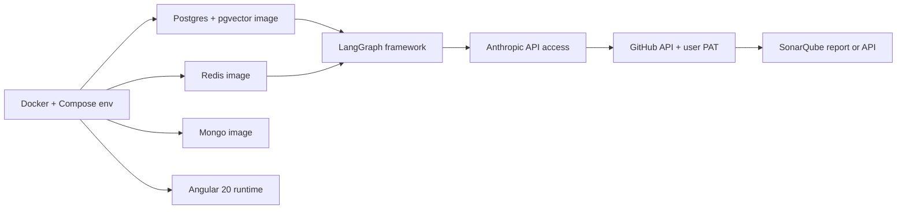

# Project Scope, Dependencies, Pitfalls & Timeline

Complements [ROADMAP.md](ROADMAP.md) (milestone-centric) and [02_implementation_plan.md](02_implementation_plan.md) (Epic/Story/Task-centric). This doc is the single-page executive view for scope, dependency management, and execution risk.

---

## 1. Scope Statement

### 1.1 In scope for v1 (Phase 1 GA)

| Category | Included |
|---|---|
| **Users** | Self-hosted, single corporate tenant. DB-based email/password auth (Argon2id). Roles: `user`, `admin`. Sessions in Redis with 8h TTL. |
| **Repos** | GitHub HTTPS repos only. Connection via user-supplied PAT, encrypted at rest with `PAT_ENCRYPTION_KEY`. Per-user and per-repo concurrency caps. |
| **Phase 1 (Sonar Fixer)** | Full end-to-end: Sonar JSON upload **or** live Sonar API → ranked fixes → LLM-proposed patches → structural validation (AST, lint delta, optional compile) → branch + PR. Java, Python, TypeScript validators. |
| **Phases 2–5** | Stubbed subgraphs wired to the router, marked `preview` in the UI. Configurable but non-executing. Contract frozen at M10. |
| **UI** | Angular 20 SPA: login, repos list, connect repo, repo detail/settings, new-run phase picker, Sonar Fix configure form, live progress (SSE), run summary, runs history, per-run audit. Stubs for admin/audit-log/metrics/settings. |
| **Backend** | FastAPI API, Arq worker fleet, LangGraph orchestrator with Postgres checkpointer. LLM Gateway with Anthropic primary (Claude). |
| **Persistence** | Postgres 16 (operational + LG checkpointer + pgvector scaffold), Redis 7 (queue + sessions + pub/sub + streams), MongoDB 7 (telemetry, LLM archives, audit). |
| **Deployment** | Rocky Linux 9 host via Docker Compose. |
| **Observability** | Structured JSON logs to stdout, Mongo telemetry sink, Prometheus `/metrics`, OpenTelemetry traces (opt-in). |
| **Security baseline** | PAT encryption, Argon2id hashing, `HttpOnly; Secure; SameSite=Lax` cookies, CSRF on state-changing endpoints, no default-branch writes, secrets-in-YAML startup reject, structlog secret redactor. |

### 1.2 Out of scope for v1 (explicit, to prevent drift)

- Phases 2–5 execution (stubs only).
- **GitHub App** installation flow (PAT only for v1).
- GitHub OAuth device flow (considered after Rancher migration).
- Multi-tenancy across corporate orgs (single-tenant deployment).
- Cross-phase composition in a single run.
- Fine-tuning or continuous learning.
- Mobile / tablet responsive layouts (desktop-first, min-width 1024px).
- Rancher / Kubernetes packaging (target: DE-1 post-P1 GA).
- ZTIAP authentication (target: DE-2 post-P1 GA).
- Managed datastores (target: DE-3 post-P1 GA).
- Cross-run patch review UI (review in GitHub PR, not in-app).

### 1.3 Scope change protocol

Any request to add an out-of-scope item before P1 GA goes through a **scope amendment**:

1. Name the item, its justification, and which in-scope item (if any) it displaces.
2. If it touches the orchestrator contract — reject unless an ADR addendum is attached.
3. If it extends the UI surface — check against [01_mockup_validation.md](01_mockup_validation.md) §4 decision matrix.
4. If accepted, update ROADMAP timeline and notify the roadmap owner in the same PR.

---

## 2. Dependencies

### 2.1 Technical dependencies (sequenced)

| Dependency | Owner | Readiness | Risk if blocked |
|---|---|---|---|
| Rocky Linux 9 demo host | Platform team | Available | Low — local dev doesn't block |
| Anthropic API key + quota | Procurement | **Must secure** before M5 | High — blocks every LLM-using milestone |
| GitHub access (users' own PATs) | End users | Self-serve at connect time | Low |
| SonarQube instance or exported report | User | User-supplied | Low — fixture reports cover dev |
| `PAT_ENCRYPTION_KEY` KEK provisioning process | Security team | **Must define** before M1 | High — blocks prod use of repo connect |
| Corporate nginx TLS / reverse proxy | Platform team | Needed before demo | Medium — can demo on localhost without |
| Container registry / image host | Platform team | Needed before demo | Medium |

### 2.2 Organizational dependencies

| Dependency | Owner | Latest acceptable date | Gating milestone |
|---|---|---|---|
| Budget approval for prod-grade LLM quota | Finance + Engineering lead | Before M5 | LLM Gateway (M5) |
| Designer pack 1 (auth errors, signup, reset, session-expired) | Design | Before M1 UI work | M1 |
| Designer pack 2 (destructive modals) | Design | Before M7 | M7 |
| Designer pack 3 (queued + failed run states) | Design | Before M7 | M7 |
| Security review sign-off | Security team | During M9 | P1 GA |
| Legal / privacy review on PAT handling | Legal | Before first non-dev use | P1 GA |
| ZTIAP integration specs | IAM team | Before DE-2 (post-GA) | Stage 2 |
| Rancher cluster access | Platform team | Before DE-1 (post-GA) | Stage 2 |

### 2.3 External / vendor dependencies

- **Anthropic SDK API stability** — pin to `anthropic>=0.40,<1.0`; test upgrades monthly. New Claude models may require prompt-pack tweaks.
- **LangGraph library stability** — pin to `langgraph>=0.2,<1.0`; upgrade in a separate PR with a full regression run before merge.
- **GitHub API rate limits** — user PATs share the 5k req/hr default. Workers must backoff on 429 and record rate-limit events to Mongo.

---

## 3. Pitfalls

These are the specific, named failure modes that have bitten systems like this before. Not generic "be careful" warnings.

### 3.1 LLM / AI pitfalls

| # | Pitfall | Mitigation |
|---|---|---|
| P-01 | **LLM hallucinates file paths / symbols that don't exist.** Patch passes diff-apply because it's syntactically valid, but references nothing real. | Structural validator checks overlap with reported Sonar line ±3 AND that referenced symbols exist via tree-sitter query. Never `LLM-as-judge`. |
| P-02 | **Confident-wrong patches.** LLM returns `confidence: 0.95` for a patch that is subtly broken. | Confidence is a **soft** signal only. Hard gates are structural. Track confidence-vs-outcome telemetry to detect drift. |
| P-03 | **Prompt cache poisoning across runs.** A repo-layer cache entry contains stale outline info after the tree mutates. | Cache key includes a content hash of the outline; repo-layer invalidates when RIL rebuilds. |
| P-04 | **Token budget blow-out on pathological repos.** One very large file + complex prompt eats the whole budget. | Per-file context trimming; per-run budget gate sets `status=PARTIAL` before blow-out. |
| P-05 | **Structured output instability across model upgrades.** A prompt that worked on `claude-sonnet-4-6` breaks on `4-7`. | Prompt packs versioned; CI runs golden-output tests on each supported model role before merge. |

### 3.2 Concurrency / async pitfalls

| # | Pitfall | Mitigation |
|---|---|---|
| P-06 | **Concurrency slot leak on worker crash.** Run counted as active forever. | TTL on Redis counter keys matches run hard timeout; Lua script cleanup on worker startup scans for orphaned run rows. |
| P-07 | **Two workers pick up the same run_id** due to at-least-once queue semantics. | `Run.worker_id` set via `UPDATE ... WHERE status='pending' RETURNING` (compare-and-swap); second worker sees empty result and exits. |
| P-08 | **SSE connection pile-up** under slow clients. | Bounded per-connection buffer; disconnect on buffer overflow with reason. Active-connection gauge in metrics. |
| P-09 | **Redis pub/sub vs. streams confusion.** Using pub/sub for progress means no reconnect replay. | Use **streams** (`XADD`/`XREAD`) with `MAXLEN ~ 1000`. Reconnect via `Last-Event-ID` works because streams are durable until trimmed. |
| P-10 | **LangGraph checkpointer deadlock** on high-concurrency writes. | One `thread_id=run_id` per run; workers do not write to each other's checkpoints. |

### 3.3 Security pitfalls

| # | Pitfall | Mitigation |
|---|---|---|
| P-11 | **PAT leak via logs.** Structlog bind accidentally includes the raw token. | Structlog redactor matches `*token*`, `*key*`, `*password*`, `*secret*`, `authorization` case-insensitive. Tests assert the redactor catches a synthetic token. |
| P-12 | **PAT leak via Postgres backup.** Backup export contains `pat_ciphertext`; if the KEK also leaks, full compromise. | KEK stored in env var injected by an external secret manager, **never** dumped with the DB. KEK rotation procedure documented. |
| P-13 | **Default-branch write.** Bug in branch-name derivation pushes to `main`. | `GitHubTool.push()` rejects default / `main` / `master` unconditionally unless `allow_default_branch=true`. Unit test asserts refusal. Branch-name convention enforced in a second layer. |
| P-14 | **CSRF on state-changing endpoints.** Cookie-based auth + unprotected POST = CSRF. | CSRF token cookie + header required on every non-GET; FastAPI dependency rejects mismatches. Login issues a new CSRF token. |
| P-15 | **Workspace path traversal.** A crafted filename escapes `workspace_root`. | `FSTool` resolves every path via `Path.resolve()` and asserts `startswith(workspace_root)`. |
| P-16 | **Session fixation on privilege escalation.** Admin grant doesn't rotate session. | `AuthProvider.rotate_session` called on any role change; old session revoked in Redis. |

### 3.4 Data / persistence pitfalls

| # | Pitfall | Mitigation |
|---|---|---|
| P-17 | **Run events unbounded in Postgres.** Hot table grows 1M+ rows quickly. | Keep last 200 per run in Postgres via trigger/trim; full history in Mongo. |
| P-18 | **Mongo TTL index missed on upgrade.** Archives grow unbounded. | Bootstrap sink creates TTL indexes idempotently at worker startup; Prometheus gauge on collection size. |
| P-19 | **Postgres connection pool exhaustion** during worker parallelism. | Pool size = workers × 3; backpressure on `acquire` ≥ 1s emits a metric + log warning. |
| P-20 | **pgvector index absent on non-empty table** after a bad migration. | Migration includes `CREATE INDEX IF NOT EXISTS` + a smoke query assertion in CI. |

### 3.5 Product / UX pitfalls

| # | Pitfall | Mitigation |
|---|---|---|
| P-21 | **User opens a PR they don't want** because zero-debt pushed without a preview. | Default to **draft PR**; explicit flag to open non-draft. Copy in the run summary makes this clear. |
| P-22 | **Queued state looks broken.** User clicks Enqueue and sees nothing for 20s. | Dedicated "queued" UI state with queue-position and worker-availability copy (designer pack 3, S-13). |
| P-23 | **Partial-success confused for failure.** `status=partial` without explanation = user panic. | Summary screen variant for partial runs shows exactly which issues were fixed vs. skipped, with reasons. |
| P-24 | **Cancelled run leaves a dangling branch** on GitHub. | On cancellation after push, branch is left in place with a comment; PR auto-closed. Run summary shows "cancelled — branch preserved for inspection." |

---

## 4. Timeline

Effort at one FTE. Add 30% for team overhead; reduce by 30% for two FTEs running in parallel where epic dependencies allow.

### 4.1 To P1 GA (demo + production-quality)

| Phase | Duration | Weeks | Key deliverables |
|---|---|---|---|
| **M0** — Monorepo skeleton | 1.5 | W1–W1.5 | Compose up, Angular scaffold, API scaffold, CI bootstrap |
| **M1** — Auth + user/repo models | 2.0 | W1.5–W3.5 | Login works end-to-end, repo connect, per-phase settings |
| **M2** — Orchestrator spine | 1.5 | W3.5–W5 | Stub subgraph runs in worker, LG checkpointer wired |
| **M3** — Job queue + SSE | 1.5 | W5–W6.5 | UI sees live progress for a stub run end-to-end |
| **M4** — RIL v1 | 1.0 | W6.5–W7.5 | Java + Python + Rust fixture outline emits correctly |
| **M5** — LLM Gateway | 1.0 | W7.5–W8.5 | Golden-path Claude call + Mongo archive lands |
| **M6** — P1 subgraph | 2.5 | W8.5–W11 | Fixture run fixes ≥7/10 Sonar issues on a real OSS repo |
| **M7** — Delivery + P1 UI | 1.5 | W11–W12.5 | User submits from UI → real PR lands on test repo |
| **M8** — Telemetry + audit | 1.0 | W12.5–W13.5 | Full audit trail searchable in UI; Mongo collections healthy |
| **M9** — Harden P1 | 1.5 | W13.5–W15 | SLOs met, security sign-off, 0 broken commits on benchmark |
| **M10** — Phase contract freeze | 0.5 | W15 | P2–P5 routing stubs, UI stubs for admin/audit/metrics/settings |

**Target P1 GA: Week 15** (≈3.5 calendar months at 1 FTE; ≈2 calendar months at 2 FTEs working frontend + backend in parallel after M2).

### 4.2 Post-GA expansion

| Track | Duration | Concurrent? |
|---|---|---|
| **P2 — Unit Test Generator (Java / Python / Rust)** | 3–4 weeks | Yes, after M10 |
| **P3 — Code Reviewer** | 2–3 weeks | Yes, after M10 |
| **P4 — PR Auto-Fixer** | 2 weeks | After P3 (reuses patterns) |
| **P5 — E2E Playwright Generator** | 3 weeks | Yes, after M10 |
| **DE-1 — Rancher packaging** | 2 weeks | Yes, can run alongside P2–P5 |
| **DE-2 — ZTIAP integration** | 1.5 weeks | After DE-1 |
| **DE-3 — Managed datastores** | 1 week | After DE-1 |

### 4.3 Critical path

`M0 → M1 → M2 → M3 → M6 → M7 → M9`. A slip in any of these moves P1 GA by the same amount. M4 and M5 can slip 0.5 weeks each without moving GA (they're on parallel lanes to the P1 subgraph prep).

### 4.4 Confidence intervals

| Milestone | Best-case | Expected | Worst-case driver |
|---|---|---|---|
| M1 | 1.5 wk | 2.0 wk | Designer pack 1 slip |
| M6 | 2.0 wk | 2.5 wk | LLM fix-rate tuning |
| M9 | 1.0 wk | 1.5 wk | Security review iteration |
| **P1 GA total** | **~13 wk** | **~15 wk** | Stack up of the above |

### 4.5 Kill / go-slow triggers

- **Kill trigger:** fix rate on the curated SonarQube benchmark at M9 is below 60% after three prompt-tuning iterations. Re-evaluate LLM role selection and patch strategy; delay GA by ≥2 weeks.
- **Go-slow trigger:** M6 slips by more than 1 week. Cut scope for M10 (phase contract freeze) by stubbing fewer phases or deferring admin UI stubs to post-GA.
- **Continue trigger:** M6 ends with ≥80% fix rate and 0 broken commits on benchmark. Proceed straight into M7 with confidence.

---

## 5. Assumptions Called Out

These assumptions underpin the plan. If any breaks, revisit the affected sections.

1. Anthropic API quota and pricing are available at the volume needed (estimated 20–50M tokens/week at peak).
2. Corporate network allows outbound HTTPS to `api.anthropic.com`, `api.github.com`, and (if used) corporate SonarQube.
3. Users have GitHub PATs with `repo` scope or can create them.
4. The Rocky Linux 9 demo host has ≥8 CPU, ≥16 GB RAM, ≥200 GB disk for workspaces.
5. Phase 1 benchmark corpus (public OSS repos with high-quality Sonar reports) is available by M6.
6. The designer can deliver pack 1 within 2 weeks of M0 start, packs 2 & 3 within 4 weeks of M0 start.
7. Security review can be scheduled to overlap M8–M9 (not block after M9).
8. Budget for prod-grade LLM usage is approved by end of M4.

---

## 6. What "Done" Looks Like at P1 GA

A binary checklist. If any item is not green, we are not GA.

- [ ] Fresh `docker compose up` on a Rocky 9 host boots the stack; `/healthz` green on `api` + `worker`.
- [ ] New user signs up (admin-approved), logs in, connects a private GitHub repo via PAT.
- [ ] User uploads a real SonarQube JSON report (≥50 issues) and enqueues a Sonar Fix run.
- [ ] UI shows queued → running → node-by-node progress via SSE → terminal within 30 minutes.
- [ ] Worker restart mid-run resumes from checkpoint without re-doing LLM work.
- [ ] Terminal run lands a **draft** PR on GitHub with ≥80% of findings fixed on the benchmark corpus.
- [ ] Zero broken commits (all PRs build/lint cleanly against the target repo's CI).
- [ ] Full audit trail for the run visible in UI and NDJSON-exportable.
- [ ] Security review signed off on: PAT handling, session lifecycle, secret redaction, default-branch refusal.
- [ ] Runbook published: backup/restore for Postgres, KEK rotation, worker scale-up.
- [ ] P2–P5 stubs routable from UI (marked `preview`); no orchestrator changes required to enable any of them.
