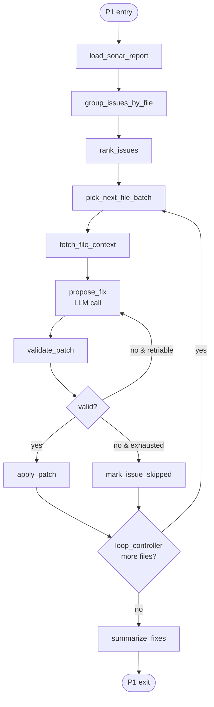

# Phase 1 Blueprint — SonarQube Recommendation Fixer

> Reference this doc when running "implement Phase 1." Architecture context lives in [ARCHITECTURE.md](ARCHITECTURE.md); this file is the node-level plan.

---

## 0. Invocation Context

P1 runs inside an Arq worker, dequeued from Redis, triggered by a UI-driven `POST /runs` call. The subgraph below knows nothing about UI, auth, or queueing — it receives a fully-populated `ZeroDebtState` with `user_id`, `repo_connection_id`, `run_id`, and `phase_input` set by the API tier, and it publishes progress events to the run-scoped Redis channel so the UI can stream them. See ARCHITECTURE §2.7 (async execution model) and §2.8 (SSE).

Inputs to `phase_input`:
- Either `sonar_report_uri` (uploaded report blob in workspace) or `sonar_query` (live API fetch config).
- Optional per-repo overrides resolved from `REPO_SETTING.config_override` and merged over `config.phases.sonar_fix`.

---

## 1. Subgraph Topology



## 2. Node-by-Node Plan

| # | Node | Responsibility | Inputs (state) | Outputs (state) |
|---|---|---|---|---|
| 1 | `load_sonar_report` | Parse SonarQube JSON (local file or `/api/issues/search`), validate via `SonarReport` Pydantic model. Fail fast on schema mismatch. | `phase_input.report_path` or `phase_input.sonar_query` | `phase_input.issues: List[SonarIssue]` |
| 2 | `group_issues_by_file` | Bucket by `component` (file path). Files absent from working tree → `warnings`, dropped. | `phase_input.issues`, `repo_outline.files` | `phase_input.issues_by_file: Dict[str, List[SonarIssue]]` |
| 3 | `rank_issues` | Score = `severity_weight × rule_fixability_score × file_churn_penalty`. Stable sort → deterministic reruns. | `phase_input.issues_by_file` | `phase_input.ranked_files: List[str]` |
| 4 | `pick_next_file_batch` | Pull the highest-ranked file with pending issues. **One file atomically** — avoids intra-file patch conflicts. | `phase_input.ranked_files`, `phase_input.cursor` | `phase_input.current_file`, cursor++ |
| 5 | `fetch_file_context` | Load target file + N neighboring symbols (resolved via `repo_outline.module_graph`). Bounded by token budget. | `phase_input.current_file`, `repo_local_path` | `phase_input.file_context` |
| 6 | `propose_fix` | LLM call through `LLMGateway` with `json_schema` enforced. Response: `{patches: [{path, unified_diff, rationale, confidence}], unfixable: [{issue_key, reason}]}`. | `phase_input.file_context`, issues for file, prior error feedback | `phase_input.proposal`, `llm_token_usage` |
| 7 | `validate_patch` | Multi-gate: (a) `patch --dry-run` clean, (b) AST parses, (c) lint doesn't regress (delta), (d) optional compile via `config.validate_with_compile`, (e) diff overlaps issue line ±3. | `phase_input.proposal`, working tree | `phase_input.validation` |
| 8 | `apply_patch` | Write patch to working tree. On failure, roll back file to HEAD, mark issue skipped. | `phase_input.proposal` (if valid) | working tree (side effect), `phase_output.applied` |
| 9 | `loop_controller` | Increment `phase_iteration`. Abort on `phase_iteration >= max_issues_per_run × 2` or consecutive-failure threshold. | `phase_input.ranked_files`, `phase_iteration` | `phase_iteration` |
| 10 | `summarize_fixes` | Per-issue disposition table, token usage, duration, final `status`. | `phase_output.applied`, skipped lists | `phase_output.summary`, `status` |

## 3. Data Contracts

```python
from pydantic import BaseModel, Field
from typing import Literal, Optional

class SonarIssue(BaseModel):
    key:       str
    rule:      str
    severity:  Literal["INFO", "MINOR", "MAJOR", "CRITICAL", "BLOCKER"]
    component: str                       # file path relative to repo root
    line:      Optional[int]
    message:   str
    effort:    Optional[str]
    type:      Literal["BUG", "VULNERABILITY", "CODE_SMELL"]

class ProposedPatch(BaseModel):
    path:         str
    unified_diff: str                    # must parse under unidiff
    rationale:    str
    confidence:   float = Field(ge=0.0, le=1.0)
    addresses:    list[str]              # issue keys this patch targets

class FixProposal(BaseModel):
    patches:   list[ProposedPatch]
    unfixable: list[dict]                # [{issue_key, reason}]

class AppliedFix(BaseModel):
    issue_key:  str
    file:       str
    patch_hash: str
    validation: dict                     # which gates passed

class FixSummaryReport(BaseModel):
    run_id:        str
    issues_total:  int
    issues_fixed:  int
    issues_skipped:int
    files_touched: list[str]
    branch:        str
    pr_url:        Optional[str]
    tokens_total:  int
    duration_sec:  float
    disposition:   list[dict]            # per-issue outcome
```

## 4. Error Handling Contracts

| Error Class | Example | Handling |
|---|---|---|
| **Transient API** | GitHub 502, LLM 429 | Exponential backoff up to `config.retry.max_attempts`. Node-level — never escalates unless exhausted. |
| **Permanent API** | GitHub 403 (token scope), LLM 401 | `fail_fast_handler`, `status=FAILED`. No retry. |
| **Ambiguous Fix** | `confidence < 0.6` or multiple valid patches | Skip with `reason="ambiguous"`. Never guess. |
| **LLM Hallucination** | Diff references nonexistent symbols / paths | `validate_patch` rejects; retry up to `per_file_iteration_cap` with error fed back into prompt. Then skip. |
| **Patch Conflict** | `patch` fails (line numbers drifted) | Rebuild file context from current HEAD, re-propose once. Then skip. |
| **Validation Regression** | Post-patch AST fails, or lint gains new errors | Reject, roll back, skip. **Never commit broken code.** |
| **Fix-loop Oscillation** | Identical proposal re-emitted after rejection | Content-hash proposals; reject identical retries; skip. |
| **Out-of-budget** | `llm_token_usage.total > config.token_budget` | Graceful stop: finalize what's applied, `status=PARTIAL`. |

**Hallucination guardrail principle:** validation is **structural, not semantic** — we verify the diff maps to real lines/symbols and doesn't regress compile/lint. We do not ask the LLM to self-evaluate. See [ADR-0005](adr/0005-structural-patch-validation.md).

## 5. LLM Prompt Strategy

Three-layer composition, each layer cached independently where the provider supports prompt caching:

1. **System layer (cache-stable):** role, strict JSON output contract, refusal policy for destructive patches, language-agnostic patch format rules.
2. **Repository layer (cache-warm):** RIL outline snippet — languages, frameworks, conventions, lint config excerpt. Invalidated only when RIL is rebuilt.
3. **Task layer (cache-cold):** target file contents, neighboring symbol slices, the specific Sonar issue(s) being fixed, prior-attempt error feedback on retries.

**Output enforcement:** `json_schema` on every `propose_fix` call. Unified diff is the required patch format — not file rewrites — because diffs are localized and reviewable. Rewrites invite collateral edits. Each patch carries `rationale` and `confidence` (used as a soft gate alongside structural validation).

**Retry prompt delta:** on validation failure, append a terse error section (e.g., `"Prior attempt rejected: AST parse failed at line 42 — 'unexpected token }'"`). Never repeat full task context. Stable layers stay cached.

## 6. Checkpoint Boundaries

Every node that (a) mutates the working tree (`apply_patch`), or (b) calls an external API (`propose_fix`) is a checkpoint boundary. If the container dies mid-run, the Postgres-backed checkpointer replays from the last committed state.

## 7. Acceptance Criteria (M4 → M6)

- **M4 exit:** fixture run against a curated 10-issue report on a real OSS repo → ≥7 issues fixed, 0 broken commits.
- **M6 exit (GA):** ≥80% fix rate on a curated SonarQube report benchmark (Java, TypeScript, Python), zero broken compiles, 100% error-matrix coverage in tests, structured logs validated against schema.

## 8. Open Decision Points (defer to M1 kickoff)

- **Batching strategy:** all issues for one file in one LLM call (token-efficient, risk of conflated patches) vs. issue-by-issue (simpler, costlier). **Current default: batch-per-file** with schema forcing per-issue patch separation.
- **Validator backend:** tree-sitter (breadth) vs. language-native parsers (precision). **Current default: tree-sitter for MVP**, language-native for Java/TypeScript post-M4.
- **Sonar fetch mode:** local JSON file (dev-first) vs. live `/api/issues/search` query. Support both; CLI accepts either `--report` or `--sonar-url + --project-key`.
