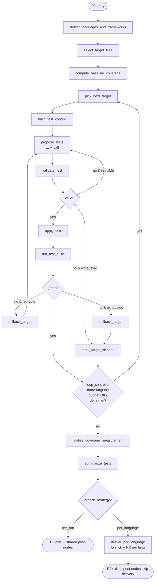

# Phase 2 Blueprint — Unit Test Generator (Java / Python / Rust)

> Reference this doc when running "implement Phase 2." Architecture context lives in [ARCHITECTURE.md](ARCHITECTURE.md); language tooling lives in [TOOLS.md](TOOLS.md) §4.3.1; this file is the node-level plan. Phase 2 reuses the orchestrator spine, RIL, LLM Gateway, delivery layer, telemetry, and SSE infrastructure shipped in Phase 1 (M0–M10) — everything below is net-new surface only.

---

## 0. Invocation Context

P2 runs inside an Arq worker, dequeued from Redis, triggered by a UI-driven `POST /api/runs` call with `phase=unit_test_gen`. The subgraph below knows nothing about UI, auth, or queueing — it receives a fully-populated `ZeroDebtState` with `user_id`, `repo_connection_id`, `run_id`, and `phase_input` set by the API tier, and it publishes progress events to the run-scoped Redis stream so the UI can stream them. See ARCHITECTURE §2.7 (async execution model) and §2.8 (SSE).

`phase_input` shape (validated at the subgraph boundary by `UnitTestGenInput` Pydantic model):

| Field | Type | Default | Notes |
|---|---|---|---|
| `target_file_globs` | `list[str]` | `["**/*"]` (filtered to detected langs) | Repo-relative POSIX globs. Source files only — test dirs auto-excluded. |
| `languages` | `list[Literal["java","python","rust"]]` | auto from RIL | Override which languages to process. Order = priority. |
| `coverage_target_delta` | `float` | `0.10` | Target coverage uplift, fraction (0.10 = +10 pp). Stop early if met. |
| `max_files_per_run` | `int` | `40` | Hard cap on files attempted. |
| `max_files_per_language` | `int` | `20` | Per-language sub-cap. |
| `per_file_iteration_cap` | `int` | `2` | Max LLM retries on the same target. |
| `framework_overrides` | `dict[str, str]` | `{}` | e.g. `{"java": "junit5+mockito"}`. Defaults inferred from RIL. |
| `mutate_production_code` | `bool` | `false` | If `false`, validator rejects any patch that edits non-test files. |
| `coverage_tool_overrides` | `dict[str, str]` | `{}` | e.g. `{"rust": "tarpaulin"}` — `tarpaulin` or `llvm-cov`. |
| `branch_strategy` | `Literal["per_run","per_language"]` | `"per_run"` | Single branch vs. one per language. When `per_language`: branching and PR creation are handled inside the P2 subgraph by `deliver_per_language` (see §1 mermaid and §2 row 15); `phase_output["delivery_required"]` is set to `False` so the shared post-nodes skip delivery. |
| `dry_run` | `bool` | `false` | Skip `apply_test` and delivery; report what *would* be written. |
| `llm_model_role` | `str` | `code-smart` | Logical model id resolved by `LLMGateway`. |

Resolution order for any field above: `phase_input` ← `repo_setting.config_override.unit_test_gen` ← `config.phases.unit_test_gen` ← built-in default.

---

## 1. Subgraph Topology



**Delivery handoff.** For `branch_strategy=per_run` (default): `summarize_tests` sets `phase_output["delivery_required"] = True` and `phase_output["work_branch_hint"]`; the shared post-nodes (`commit_and_push_branch` → `open_pull_request` → `generate_summary_report`) handle the rest. For `branch_strategy=per_language`: `deliver_per_language` creates N branches and N PRs inside the subgraph, then `summarize_tests` sets `phase_output["delivery_required"] = False`; the shared post-nodes are no-ops for delivery. In both cases `phase_output["delivery_required"]` is the only key `post_phase_normalize` reads.

---

## 2. Node-by-Node Plan

| # | Node | Responsibility | Key Inputs (state) | Key Outputs (state) | External calls |
|---|---|---|---|---|---|
| 1 | `detect_languages_and_frameworks` | From `repo_outline`, decide which languages will be processed and resolve a `LanguageStrategy` per language. Reject if a requested language has no detected source. Resolve test framework + coverage tool per language. | `repo_outline.languages`, `repo_outline.frameworks`, `repo_outline.test_frameworks`, `repo_outline.build_systems`, `phase_input.languages`, `phase_input.framework_overrides`, `phase_input.coverage_tool_overrides` | `phase_input.lang_plan: list[LanguagePlan]` | none |
| 2 | `select_target_files` | Walk `repo_outline.files`, apply `target_file_globs`, exclude test dirs (`**/test/**`, `tests/`, `**/*.test.ts`, etc.) and generated dirs (`target/`, `build/`, `dist/`, `node_modules/`, `__pycache__/`). Rank by `(uncovered_loc × churn × complexity_score)` — higher first. Cap by `max_files_per_run` and per-language. | `phase_input.lang_plan`, `repo_outline.files`, `repo_outline.module_graph` | `phase_input.targets: list[TestTarget]`, `phase_input.cursor: int = 0` | none |
| 3 | `compute_baseline_coverage` | Per language, invoke `LanguageStrategy.run_coverage_baseline()` on the unmodified working tree. Persist a structured `CoverageSnapshot` per language to `phase_input.baseline_coverage`. Baseline failure on a language → drop that language with a warning, continue with the rest. | `phase_input.lang_plan`, `repo_local_path` | `phase_input.baseline_coverage: dict[lang, CoverageSnapshot]` | subprocess: `mvn`, `gradle`, `coverage`, `cargo-tarpaulin` / `cargo-llvm-cov` |
| 4 | `pick_next_target` | Pop the next `TestTarget` from `phase_input.targets[cursor]`. Skip targets whose language was dropped in step 3. **One file atomically.** | `phase_input.targets`, `phase_input.cursor` | `phase_input.current_target: TestTarget`, cursor++ | none |
| 5 | `build_test_context` | Load via `FSTool`: target source + N neighbors via `repo_outline.module_graph` + 1–2 existing tests in the same package as exemplars + the language strategy's `style_block` (test-framework conventions). Token-bound by `context_token_budget`. | `phase_input.current_target`, `repo_outline.module_graph`, `repo_local_path` | `phase_input.test_context: TestContext` | none |
| 6 | `propose_tests` | Single `LLMGateway.complete()` with three-layer prompt and `json_schema=TestProposal.model_json_schema()`. Response: a list of `ProposedTestFile` (full file content or unified diff against existing test) + `unfixable` rationale list. | `phase_input.test_context`, prior failure feedback (if any) | `phase_input.proposal: TestProposal`, `llm_token_usage` | LLM |
| 7 | `validate_test` | Structural gates *before* execution: (a) `unidiff` parse / file-write paths jail-checked, (b) tree-sitter AST parse of every proposed test file, (c) **production-code firewall**: reject if `mutate_production_code=false` and any path in proposal is not under the language's test root, (d) lint delta (`ruff`/`eslint`/`clippy`/checkstyle wrapper) doesn't regress, (e) framework-shape check (e.g. Java file declares `@Test` import; Python file imports `pytest` or `unittest`; Rust file has `#[test]` or `#[cfg(test)]`), (f) test name uniqueness vs. existing suite. | `phase_input.proposal`, working tree | `phase_input.validation: ValidationReport` | tree-sitter, `LanguageTool` lint |
| 8 | `apply_test` | Write the proposed file(s) via `PatchTool` (atomic per file). Record applied paths. **No git operations** — the post-node `commit_and_push_branch` does that. | `phase_input.proposal` (if valid) | working tree mutation, `phase_output.applied_tests: list[AppliedTest]` | none |
| 9 | `run_test_suite` | Execute the language's test runner scoped to the new tests where the framework supports it (`mvn -B -Dtest=NewClassName test`, `pytest path/to/new_test.py -q`, `cargo test --test new_module`). Capture exit code + parsed result counts (passed / failed / skipped). On failure, capture failure messages for retry feedback. Hard timeout via `LanguageStrategy.test_timeout_sec`. | `phase_input.current_target`, `phase_output.applied_tests[-1]` | `phase_input.last_run_result: TestRunResult` | subprocess |
| 10 | `rollback_target` | On red test or exhausted retries, revert the working-tree changes for `current_target` only via `GitTool.checkout -- <paths>`. Other applied tests stay. Mark the target skipped. | `phase_output.applied_tests[-1]` (transiently) | working-tree reset for those paths, `phase_output.skipped_targets += [...]` | git |
| 11 | `mark_target_skipped` | Append a `SkippedTarget(reason, errors)` to `phase_output.skipped_targets` and emit a structured warning event. | `phase_input.current_target`, `phase_input.validation`, `phase_input.last_run_result` | `phase_output.skipped_targets` | none |
| 12 | `loop_controller` | Increment `phase_iteration`. Stop when *any* of: cursor exhausted, `phase_iteration >= max_files_per_run × 2`, consecutive-failure threshold reached, `llm_token_usage.total > config.token_budget`, or estimated coverage uplift already ≥ `coverage_target_delta`. | `phase_input.targets`, `phase_input.cursor`, `phase_iteration`, `llm_token_usage`, running coverage estimate | next-node decision | none |
| 13 | `finalize_coverage_measurement` | Re-run full coverage per language on the final working tree. Compute `CoverageDelta = post − baseline` per file and aggregate. Failure to measure → record warning in `measurement_errors`; do not fail the run. **Caching note:** only the baseline snapshot (from step 3) is written to the `coverage_snapshot` cache, keyed by the original HEAD commit SHA — that measurement is stable and reusable. The post-run snapshot is unique to this run's applied tests and is not cached. | `phase_input.lang_plan`, `phase_input.baseline_coverage`, working tree | `phase_output.coverage_delta: dict[lang, CoverageDeltaReport]` | subprocess (coverage tools) |
| 14 | `summarize_tests` | Build `UnitTestSummaryReport` (per-target disposition, per-language coverage delta, totals, token usage, duration). Set `phase_output.summary` and `status`. Set `phase_output["delivery_required"] = len(applied_tests) > 0 and not phase_input.get("dry_run", False)`. Delete per-run Python venv (`/opt/zerodebt/venv/{run_id}`) if present. | `phase_output.applied_tests`, `phase_output.skipped_targets`, `phase_output.coverage_delta`, `llm_token_usage`, `timings_ms`, `phase_input.branch_strategy` | `phase_output.summary`, `status`, `phase_output["delivery_required"]`, `phase_output["work_branch_hint"]` | none |
| 15 | `deliver_per_language` | **Only reached when `branch_strategy=per_language`.** For each language with applied tests, create a branch `zerodebt/p2/{run_id}/{lang}`, commit the language-scoped files, push, open a PR via `GitHubTool`, record the PR URL in `phase_output.pr_urls[lang]`. Then sets `phase_output["delivery_required"] = False` so post-node delivery is skipped. | `phase_output.applied_tests` (grouped by language), `phase_input.lang_plan` | per-language branches and PRs on GitHub (side effects), `phase_output.pr_urls: dict[lang, str]`, `phase_output["delivery_required"] = False` | `GitHubTool`, `GitTool` |

**Determinism rule.** Steps 2 and 4 must produce a stable target order for identical inputs (used for golden-file tests and resumability after a checkpoint replay).

---

## 3. Data Contracts

All Pydantic v2 models, located under `src/zero_debt/phases/unit_test_gen/models.py`. Names finalized; the implementation plan references these by name.

```python
from __future__ import annotations
from typing import Literal, Optional
from pydantic import BaseModel, Field, conlist


# ---- Inputs ----------------------------------------------------------------

LangCode = Literal["java", "python", "rust"]
TestFramework = Literal[
    "junit5+mockito", "junit5", "junit4",                # java
    "pytest", "unittest",                                # python
    "cargo-test",                                        # rust (built-in)
]
CoverageTool = Literal["jacoco", "coverage.py", "tarpaulin", "llvm-cov"]
BuildSystem = Literal["maven", "gradle", "poetry", "pip", "cargo"]


class UnitTestGenInput(BaseModel):
    target_file_globs:       list[str] = Field(default_factory=lambda: ["**/*"])
    languages:               Optional[list[LangCode]] = None        # None = auto from RIL
    coverage_target_delta:   float = Field(default=0.10, ge=0.0, le=1.0)
    max_files_per_run:       int   = Field(default=40, ge=1, le=500)
    max_files_per_language:  int   = Field(default=20, ge=1, le=500)
    per_file_iteration_cap:  int   = Field(default=2, ge=1, le=5)
    framework_overrides:     dict[LangCode, TestFramework] = Field(default_factory=dict)
    coverage_tool_overrides: dict[LangCode, CoverageTool]  = Field(default_factory=dict)
    mutate_production_code:  bool  = False
    branch_strategy:         Literal["per_run", "per_language"] = "per_run"
    dry_run:                 bool  = False
    llm_model_role:          str   = "code-smart"


class LanguagePlan(BaseModel):
    language:        LangCode
    build_system:    BuildSystem
    test_framework:  TestFramework
    coverage_tool:   CoverageTool
    source_roots:    list[str]                  # repo-relative
    test_roots:      list[str]                  # repo-relative; written-to roots
    runner_cmd:      list[str]                  # canonical full-suite test cmd; arg arrays only
    selective_cmd_template: list[str]           # template w/ {target_id} placeholder for one-test runs
    coverage_cmd:    list[str]                  # full coverage cmd
    test_timeout_sec: int                       # per selective run


# ---- Targets ---------------------------------------------------------------

class TestTarget(BaseModel):
    language:          LangCode
    source_path:       str                       # repo-relative
    symbol_count:      int                       # public funcs/methods/classes
    uncovered_loc:     int
    churn_score:       float                     # last-90-days commit count
    complexity_score:  float                     # cyclomatic proxy (0..100)
    rank_score:        float                     # uncovered_loc * churn * complexity, normalized
    expected_test_path: str                      # canonical destination for the new test file


class TestContext(BaseModel):
    target:               TestTarget
    target_source:        str                    # full file
    neighbor_snippets:    list[dict]             # [{path, code, role: "type"|"caller"|"callee"}]
    exemplar_tests:       list[dict]             # [{path, code}] from same package, max 2
    style_block:          str                    # framework conventions per language
    framework_imports:    list[str]              # canonical imports the LLM must use
    forbidden_paths:      list[str]              # production paths refused by validator
    token_budget_hint:    int


# ---- Proposals -------------------------------------------------------------

class ProposedTestFile(BaseModel):
    path:           str                          # repo-relative under a test root
    write_mode:     Literal["create", "diff"]    # "create" for new file; "diff" for unified diff against existing
    content:        Optional[str] = None         # required when write_mode == "create"
    unified_diff:   Optional[str] = None         # required when write_mode == "diff"
    rationale:      str
    confidence:     float = Field(ge=0.0, le=1.0)
    addresses:      list[str]                    # symbol identifiers covered: e.g. "com.acme.Foo#bar"


class TestProposal(BaseModel):
    language:    LangCode
    files:       conlist(ProposedTestFile, min_length=1, max_length=10)
    unfixable:   list[dict] = Field(default_factory=list)   # [{symbol, reason}]


# ---- Validation & execution -----------------------------------------------

class ValidationGateResult(BaseModel):
    gate:   Literal["unidiff", "ast", "production_firewall", "lint_delta",
                    "framework_shape", "name_uniqueness"]
    passed: bool
    reason_code: Optional[str] = None
    detail:      Optional[str] = None


class ValidationReport(BaseModel):
    gates:   list[ValidationGateResult]
    passed:  bool                                # True iff every gate passed


class TestRunResult(BaseModel):
    exit_code:   int
    passed:      int
    failed:      int
    skipped:     int
    duration_ms: int
    failures:    list[dict] = Field(default_factory=list)   # [{name, message, trace_excerpt}]
    runner:      TestFramework
    timed_out:   bool = False


# ---- Outputs ---------------------------------------------------------------

class AppliedTest(BaseModel):
    target:       TestTarget
    files:        list[str]                      # repo-relative paths written
    patch_hash:   str                            # sha256 of normalized diff for replay-detection
    run_result:   TestRunResult


class SkippedTarget(BaseModel):
    target:    TestTarget
    reason:    Literal["validation_failed", "tests_red", "ambiguous_proposal",
                       "coverage_unmeasurable", "out_of_budget", "language_dropped",
                       "duplicate_proposal"]
    detail:    str
    attempts:  int


class CoverageSnapshot(BaseModel):
    language:    LangCode
    tool:        CoverageTool
    measured_at: str                             # ISO-8601
    overall_pct: float                           # 0.0..1.0
    per_file:    dict[str, float]                # repo-relative path -> pct


class CoverageDeltaReport(BaseModel):
    language:    LangCode
    baseline:    CoverageSnapshot
    post:        Optional[CoverageSnapshot]      # None if measurement failed
    delta_overall_pct: Optional[float]
    delta_per_file:    dict[str, float] = Field(default_factory=dict)
    measurement_errors: list[str] = Field(default_factory=list)


class UnitTestSummaryReport(BaseModel):
    run_id:               str
    branch:               str
    pr_url:               Optional[str]
    targets_total:        int
    targets_succeeded:    int
    targets_skipped:      int
    files_added:          int
    files_modified:       int
    coverage_delta:       dict[LangCode, CoverageDeltaReport]
    tokens_total:         int
    duration_sec:         float
    disposition:          list[dict]             # per-target outcome, machine-readable
```

---

## 4. Per-Language Strategy

Three implementations of a common interface. Each is a pure-data + pure-function class registered in the `LanguageStrategyRegistry`. The strategy never reaches into `ZeroDebtState` directly — nodes pass it the slice it needs.

```python
# src/zero_debt/phases/unit_test_gen/strategies/base.py
from abc import ABC, abstractmethod
from pathlib import Path

class LanguageStrategy(ABC):
    code: LangCode
    default_framework: TestFramework
    default_coverage_tool: CoverageTool

    @abstractmethod
    def discover_build_system(self, repo: Path) -> BuildSystem: ...
    @abstractmethod
    def discover_test_roots(self, repo: Path, build_system: BuildSystem) -> list[Path]: ...
    @abstractmethod
    def expected_test_path(self, source_path: Path, repo: Path) -> Path: ...
    @abstractmethod
    def style_block(self) -> str: ...
    @abstractmethod
    def framework_imports(self) -> list[str]: ...
    @abstractmethod
    async def run_coverage_baseline(self, repo: Path, plan: LanguagePlan) -> CoverageSnapshot: ...
    @abstractmethod
    async def run_selective_test(self, repo: Path, plan: LanguagePlan,
                                 target_id: str) -> TestRunResult: ...
    @abstractmethod
    async def run_full_coverage(self, repo: Path, plan: LanguagePlan) -> CoverageSnapshot: ...
    @abstractmethod
    def parse_target_id(self, target: TestTarget) -> str: ...   # what to pass to selective runner
```

### 4.1 Java strategy (`strategies/java.py`)

| Concern | Implementation |
|---|---|
| Detect build system | Existence of `pom.xml` → `maven`; `build.gradle` / `build.gradle.kts` → `gradle`. Both → prefer the one referenced last in `repo_outline.build_systems`. |
| Source roots | `src/main/java` (Maven layout). Multi-module projects: walk modules from `pom.xml` `<modules>` or settings.gradle. |
| Test roots | `src/test/java` mirroring source-root structure. Created if missing. |
| `expected_test_path` | `src/main/java/com/acme/Foo.java` → `src/test/java/com/acme/FooTest.java` (suffix `Test`). |
| Default framework | `junit5+mockito`. Detect existing JUnit 4 imports → switch to `junit4` to avoid mixed-framework test failures in a module. |
| Test runner cmd | Maven: `["mvn","-B","-q","-DfailIfNoTests=false","-Dtest={target_id}","test"]`. Gradle: `["./gradlew","test","--tests","{target_id}","--no-daemon"]`. |
| Full test cmd (for coverage) | Maven: `["mvn","-B","-q","verify"]` then `["mvn","-B","-q","jacoco:report"]`. Gradle: `["./gradlew","jacocoTestReport","--no-daemon"]`. |
| Coverage tool | JaCoCo. Parse `target/site/jacoco/jacoco.xml` (Maven) or `build/reports/jacoco/test/jacocoTestReport.xml` (Gradle). |
| Per-file pct extraction | Sum `INSTRUCTION` covered/missed counters per `<sourcefile>` and remap to repo-relative path. |
| Style block | JUnit-5 conventions: `@Test`, `@DisplayName`, `assertThrows`, AAA pattern, Mockito `when().thenReturn()`. |
| Forbidden imports | `org.testng.*`, `junit.framework.*` (JUnit 3) by default. Configurable per-repo. |
| Test timeout | 300s per selective run. |
| Network behavior | `mvn -o`/`--offline` only if a populated `~/.m2` mirror is present in the worker; otherwise online with mirror configured via `MAVEN_OPTS`. |

### 4.2 Python strategy (`strategies/python.py`)

| Concern | Implementation |
|---|---|
| Detect build system | `pyproject.toml` with `[tool.poetry]` → `poetry`; otherwise `[project]` PEP-621 → `pip`. |
| Source roots | From `pyproject.toml` `tool.poetry.packages` / `[tool.setuptools.packages.find]`. Fallback: walk for top-level `__init__.py`. Exclude `tests/`, `test/`, `docs/`. |
| Test roots | `tests/` at repo root (preferred) OR `test_*.py` next to source (detected via existing layout). Strategy commits to one based on majority pattern. |
| `expected_test_path` | `src/pkg/foo.py` → `tests/pkg/test_foo.py` (root-tests layout) OR `src/pkg/test_foo.py` (sibling layout). |
| Default framework | `pytest`. Switch to `unittest` only if no `pytest` config and `unittest.TestCase` predominates. |
| Test runner cmd | `["python","-m","pytest","-q","--no-header","-x","{target_id}"]`. `target_id` = test file path or `path::TestClass::test_func`. |
| Full coverage cmd | `["python","-m","coverage","run","--branch","-m","pytest","-q"]` then `["python","-m","coverage","json","-o","-"]`. |
| Coverage tool | `coverage.py`. Parse JSON output; per-file pct = `summary.percent_covered_display / 100`. |
| Style block | pytest conventions: `def test_<thing>():`, `pytest.fixture`, `pytest.raises`, `monkeypatch`, parametrize via `@pytest.mark.parametrize`. |
| Forbidden imports | None by default. |
| Test timeout | 180s per selective run. |
| Virtualenv | Per-run venv at `/opt/zerodebt/venv/{run_id}` created during `compute_baseline_coverage` (first use); cached on the strategy instance and reused by `run_test_suite` and `finalize_coverage_measurement` within the same run. **Deleted by `summarize_tests` (the terminal subgraph node) before it exits** — never by the shared post-nodes, which must remain phase-agnostic (ARCHITECTURE §4.4). Project deps installed once via `poetry install --no-root` or `pip install -e .[test]`; `BootstrapFailed` drops the language. |

### 4.3 Rust strategy (`strategies/rust.py`)

| Concern | Implementation |
|---|---|
| Detect build system | `Cargo.toml` at repo root (single-crate) or `[workspace]` (multi-crate). |
| Source roots | `src/` per crate. For workspaces, iterate `[workspace] members`. |
| Test roots | Two patterns supported: in-source `#[cfg(test)] mod tests { ... }` blocks (for unit tests) and `tests/` integration tests. **Default for new tests: in-source `mod tests` block**, because it preserves access to private items. |
| `expected_test_path` | Same file as source — strategy emits a *diff* that appends/extends `mod tests`. For integration tests the `expected_test_path` is `tests/<crate>_<source_stem>.rs`. |
| Default framework | `cargo-test` (built-in). |
| Test runner cmd | `["cargo","test","--no-fail-fast","--quiet","--","--exact","{target_id}"]` where `target_id` is e.g. `mymod::tests::it_works`. |
| Full coverage cmd | `tarpaulin` (default): `["cargo","tarpaulin","--out","Json","--skip-clean","--workspace","--timeout","300"]`. `llvm-cov` (alt): `["cargo","llvm-cov","--json","--summary-only","--workspace"]`. |
| Coverage tool | Tarpaulin JSON parsed; per-file pct = `coverable - uncoverable / coverable`. |
| Style block | `#[test]`, `assert_eq!`, `assert!`, `#[should_panic]`, `Result<(), Box<dyn Error>>` for `?` in tests. |
| Forbidden modifications | Modifying any non-test fn body in a source file (validator enforces — see §5). |
| Test timeout | 300s per selective run; tarpaulin baseline up to 600s. |
| Network behavior | `CARGO_NET_OFFLINE=true` if `vendor/` present; otherwise online with sccache. |

### 4.4 Strategy registration

```python
# src/zero_debt/phases/unit_test_gen/strategies/__init__.py
from .java import JavaStrategy
from .python import PythonStrategy
from .rust import RustStrategy

REGISTRY: dict[LangCode, LanguageStrategy] = {
    "java":   JavaStrategy(),
    "python": PythonStrategy(),
    "rust":   RustStrategy(),
}
```

`detect_languages_and_frameworks` is the only node that consults this registry.

---

## 5. Validator Gates — Detail

Six gates run sequentially. Any failure short-circuits with a structured `ValidationGateResult`. **No LLM is consulted during validation.**

| # | Gate | Implementation |
|---|---|---|
| 1 | `unidiff`/path | If `write_mode="diff"`: `unidiff.PatchSet(content)` parses without error and `patch --dry-run` succeeds. If `write_mode="create"`: target path is jail-checked under `repo_local_path`, does not already exist (or is identical content). |
| 2 | `ast` | tree-sitter `language` grammar parses the proposed file content with **zero ERROR nodes** in the tree. |
| 3 | `production_firewall` | If `mutate_production_code=false`: every proposed path resolves under one of `LanguagePlan.test_roots` *and* (Rust special case) any in-source diff hunks touch only lines inside an `#[cfg(test)] mod` block. Hunks straddling production code → reject with `production_firewall_violated`. |
| 4 | `lint_delta` | Compute lint count *before* and *after* applying the patch in a scratch worktree clone (read-only): `ruff check --output-format json` (Python), `eslint --format json` (TS, future), `cargo clippy --all-targets --message-format json` (Rust), `mvn -B checkstyle:check` or `./gradlew checkstyleTest` (Java, only if config present). Reject if total error count increases. Warnings increase is allowed. |
| 5 | `framework_shape` | Heuristic per language: Java file imports at least one `org.junit.jupiter.api.*` symbol and declares ≥1 `@Test` method; Python file defines ≥1 `def test_*` or `class Test*`; Rust file contains `#[test]` attribute. |
| 6 | `name_uniqueness` | New test method/function names don't collide with names in existing tests under the same package/module. Collision → `duplicate_test_name`. |

Failure reason codes are stable and surfaced verbatim in the LLM retry prompt and the audit Mongo doc.

---

## 6. Error Handling Contracts

| Error class | Example | Handling |
|---|---|---|
| **Transient build failure** | `mvn` 503 from corporate Nexus mirror, `cargo` network timeout | Exponential backoff up to `config.retry.max_attempts`. Node-level. Persists across attempts within the same checkpoint. |
| **Coverage tool absent** | `tarpaulin: command not found` | Drop the language with `language_dropped` reason; continue other languages. Final summary marks language as `coverage_unmeasurable`. Does *not* fail the run. |
| **Baseline tests already red** | `mvn test` exit≠0 *before* we touched anything | Mark language baseline-red; skip the language with `precondition_failed`. Surface in summary as a top-line warning. |
| **Generated test fails to compile** | Java `javac` error, Python `SyntaxError` (caught by AST gate, but slip-through possible at runtime) | Captured as `tests_red` with the failure trace excerpt fed back into the LLM retry prompt up to `per_file_iteration_cap`. Then `rollback_target` + `mark_target_skipped`. |
| **Generated test compiles but red** | Assertion failure | Same as compile fail: retry with failure feedback once, then skip + rollback. |
| **Generated test passes but coverage unchanged** | Test exists but doesn't actually exercise target file | Allowed but recorded; `summarize_tests` flags `low_value_test=true`. We do *not* reject — humans review. |
| **Production-code edit detected** | LLM proposed editing the source under test | Validator gate 3 rejects with `production_firewall`. No retry — same prompt would re-emit. Skip with `validation_failed`. |
| **Identical proposal re-emitted on retry** | Content-hash of `TestProposal.files` matches a prior attempt | Skip with `duplicate_proposal` to avoid loops. |
| **LLM hallucinates symbols** | Test calls `Foo.barNonexistent()` | Caught at `run_test_suite` (`NoMethodError`/compilation failure). Treated as `tests_red` retry path. |
| **Out-of-budget mid-run** | `llm_token_usage.total > config.token_budget` | Loop controller halts cleanly; finalize_coverage runs on what's applied; `status=PARTIAL`. |
| **Hard timeout** | `run_hard_timeout_minutes` exceeded | Cooperative cancel between nodes raises `RunCancelled`; rollback in-flight target; finalize coverage if time allows; `status=cancelled`. |
| **Coverage report unparseable** | JaCoCo XML truncated | `finalize_coverage_measurement` records `measurement_errors` but does not fail the run. Summary flags incomplete delta. |
| **No targets after filtering** | All globs excluded everything | Run `status=SUCCEEDED` with `targets_total=0`; summary copy: "No eligible targets". Not `FAILED`. |

**Hallucination guardrail principle:** validation is *structural + executable* — we verify the diff parses, lints, and the resulting test actually runs green against real source. We never ask the LLM to self-evaluate. See [ADR-0005](adr/0005-structural-patch-validation.md).

---

## 7. LLM Prompt Strategy

Three-layer composition, each layer cached independently where the provider supports prompt caching. Mirrors P1 to keep cache-hit math predictable; the *content* is different.

1. **System layer (cache-stable):** role ("expert test author"), strict JSON output contract (`TestProposal` schema), refusal policy for editing production code unless `mutate_production_code=true`, language-agnostic test-file structure rules.
2. **Repository layer (cache-warm):** RIL outline excerpt — languages, build systems, test frameworks, lint config presence, coding conventions. Plus the **per-language `style_block`** for the active language. Invalidated only when RIL is rebuilt or language switches.
3. **Task layer (cache-cold):** `target_source` (full file), neighbor snippets, exemplar tests from the same package, the specific `TestTarget`, and on retries an error-feedback section.

### 7.1 Output enforcement

`json_schema=TestProposal.model_json_schema()` on every `propose_tests` call. The schema disallows `null` for `content` when `write_mode="create"` and for `unified_diff` when `write_mode="diff"` via Pydantic discriminator.

### 7.2 Retry prompt delta

On validation or runtime failure, the next attempt receives a **terse** error section:

```
Prior attempt rejected. Reason: framework_shape — file does not import org.junit.jupiter.api.Test.
Test runner failure: NullPointerException at FooTest.shouldComputeBar:24.
Do not change production code. Re-emit a corrected TestProposal.
```

Stable layers stay cached. Never repeat the full task context in retry feedback. Never include the prior proposal text — the LLM keeps it in its own context if relevant.

### 7.3 Token budget per call

Default budget per `propose_tests` call: 8k input + 4k output. Context trimmer (`build_test_context`) targets 6k input as a soft ceiling, leaving headroom for the retry feedback.

---

## 8. Checkpoint Boundaries

Every node that (a) mutates the working tree (`apply_test`, `rollback_target`), (b) calls an external API (`propose_tests`), or (c) shells out for >10s (`compute_baseline_coverage`, `run_test_suite`, `finalize_coverage_measurement`) is a checkpoint boundary. If the container dies mid-run, the Postgres-backed checkpointer replays from the last committed state.

**Replay invariants:**

- `compute_baseline_coverage` is idempotent: running it twice on the same tree produces the same `CoverageSnapshot` (the strategies guarantee this by passing deterministic seeds where applicable and by computing snapshots from byproduct files only).
- `apply_test` is idempotent: writing the same content to the same path is a no-op; the per-target `patch_hash` lets `loop_controller` detect "already applied" on resume.
- `run_test_suite` re-execution after restart is acceptable — repeated test runs that pass remain passing.

---

## 9. Acceptance Criteria

Phase 2 gates against the Phase-2 milestone block in [ROADMAP.md](ROADMAP.md). The roadmap currently scopes P2 at 3–4 weeks; the milestones below subdivide that block.

- **P2-M1 exit (strategy scaffolds):** `JavaStrategy.run_coverage_baseline()` returns a valid `CoverageSnapshot` for a fixture Maven project, `PythonStrategy` for a fixture pytest project, `RustStrategy` for a fixture Cargo project. CI green.
- **P2-M2 exit (subgraph happy path):** End-to-end run on the three fixture repos generates ≥1 passing test per language, per fixture, with a measurable coverage delta ≥ 1 pp. No production code modified. PR opened by the post-nodes.
- **P2-M3 exit (error-matrix coverage):** Every row in §6 has a corresponding integration test. Validator-gate matrix covered by golden tests.
- **P2 GA exit:** On a curated 3-repo benchmark (one per language, real OSS), median run produces ≥ +5 pp overall coverage with ≥80% of attempted targets succeeding, zero production-code edits, full audit trail in Mongo, summary report rendered in UI. Worker image ≤ 2 GB.

---

## 10. Open Decision Points (defer to P2-M1 kickoff)

1. **In-source vs. integration tests for Rust.** Default: in-source `mod tests` (private access). Reconsider for crates where the existing convention is integration-only.
2. **Coverage tool for Rust.** Default: `tarpaulin`. Switch to `llvm-cov` per-repo if `tarpaulin` chronically times out on large workspaces. Toggle: `coverage_tool_overrides.rust = "llvm-cov"`.
3. **Selective vs. full test execution after each apply.** Default: selective (`run_test_suite` runs only the new tests). Periodically (every N successful applies) run the full suite to catch transitive breakage. **Open: should N be configurable, or fixed at 5?**
4. **Branch strategy.** Default: one branch per run across all languages (`zerodebt/p2/{run_id}`). Per-language branches reserved for repos where CI runs separate per-language pipelines and reviewers expect language-isolated PRs. UI exposes the toggle.
5. **Coverage delta accounting.** Default: per-file pct from coverage tool, aggregated by uncovered-LOC-weighted average. **Open: should we expose mutation-testing as an alternate signal?** Out-of-scope for P2 GA; track as P2.x backlog.
6. **Worker image strategy.** Default: fat image bundling JDK 17, Maven, Gradle wrapper support, Python 3.11 + coverage tooling, rustup stable + tarpaulin. Revisit if image >2 GB or cold-start regresses past 30s — see [ROADMAP](ROADMAP.md) Open Decision #1.
7. **Test-data generation.** When the LLM can't infer realistic inputs, do we (a) skip or (b) use property-testing (Hypothesis / proptest / jqwik)? Default v1: **skip**. Property-test hooks are a P2.x candidate.
